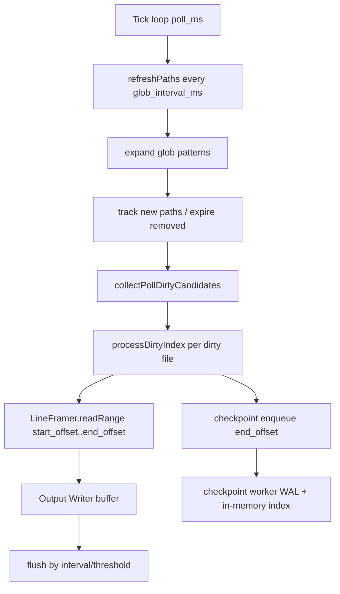
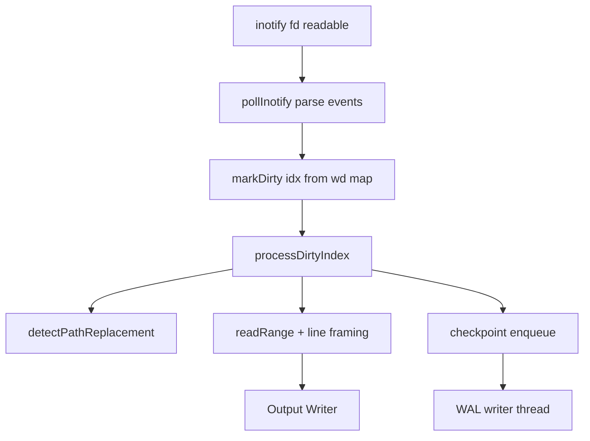
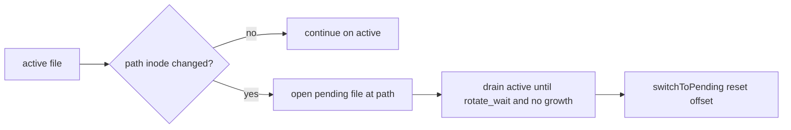
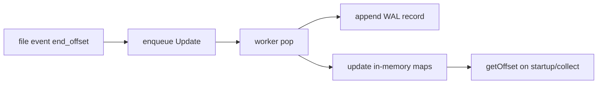

# Tero Edge

Tero Edge is a lightweight, high-performance telemetry proxy that enables
efficient telemetry processing via a set of policies. The repository is
structured as modular packages that can be composed to enable multiple use cases
and scenarios. The proxy demonstrates how to implement the policy spec described
in
[this OTEP](https://github.com/open-telemetry/opentelemetry-specification/pull/4738).
This project is not meant to replace the opentelemetry collector but rather work
in tandem with it, providing a lightweight alternative for solely applying
policies. It's expected that a follow up to this project will be a collector
processor Policy implementation.

## Current Configurations

1. **Edge data proxy** - Receives data in a gateway or sidecar configuration,
   processes the data through its policy engine, and forwards it to the next
   destination.

2. **OTLP (OpenTelemetry) proxy** - Receives OpenTelemetry logs via the
   `/v1/logs` endpoint, applies policy-based filtering (DROP/KEEP), and forwards
   to OTLP-compatible backends.

3. **Datadog proxy** - Receives OpenTelemetry logs via the `/api/v2/logs`
   endpoint, applies policy-based filtering (DROP/KEEP), and forwards to
   Datadog.

4. **Prometheus proxy** - Sits as a sidecar next to your application, proxies
   `/metrics` scrapes with streaming policy-based metric filtering, and forwards
   filtered metrics to Prometheus.

5. **Tail distribution** - Tails files/stdin, applies include/exclude/filter
   rules, and forwards or writes line-oriented output.

## Repository Structure

```
src/
├── main.zig              # Default distribution entry point
├── datadog_main.zig      # Datadog-focused distribution entry point
├── otlp_main.zig         # OTLP-focused distribution entry point
├── prometheus_main.zig   # Prometheus-focused distribution entry point
├── edge_tail_main.zig    # Tail-focused distribution entry point
├── lambda_main.zig       # AWS Lambda extension entry point
├── root.zig              # Library root (public API exports)
│
├── core/                 # Runtime primitives: limits, conn slab, arena pool, Io
├── frontend/             # Inbound HTTP: stdio and httpz, and the shared paths
├── service/              # Routing and per-signal request planning
├── signals/              # Protocol record types and their policy accessors
├── pipeline/             # Framing, codecs, and the streaming record pipeline
├── runtime/              # Process lifecycle, distributions, metrics
├── tail/                 # File and stdin tailing for edge-tail
├── config/               # Configuration parsing (non-policy)
├── lambda/               # AWS Lambda extension support
└── zonfig/               # Comptime configuration with env overrides
```

## External Dependencies

Edge consumes the following shared modules from
[policy-zig](https://github.com/usetero/policy-zig):

- **`policy_zig`** - Policy engine, registry, matchers, transforms, and
  Hyperscan/Vectorscan bindings
- **`proto`** - Protobuf types (policy, common, OTLP
  logs/metrics/trace/resource)
- **`o11y`** - Observability (EventBus, structured logging, spans)

## Package Overview

### `core/` - Runtime primitives

`limits.zig` holds every buffer constant and the data-plane budget.
`conn_slab.zig` and `arena_pool.zig` are the per-connection slot allocators the
stdio frontend claims from. `io_select.zig` is the only place outside the
platform backends that names a concrete `std.Io` implementation.

### `frontend/` - Inbound HTTP

Two frontends behind one comptime switch (`-Dfrontend`, default `stdio`), and
the request path they share. `stdio/` is `std.Io`-native and runs a task per
connection; `httpz/` is the older event loop with a worker pool. `paths.zig`,
`exchange.zig` and `exec.zig` are frontend-neutral: routing outcomes, the
upstream exchange with its retry and eviction rules, and the per-record
evaluation loop.

### `service/` - Routing

`router.zig` matches a method and path to a plan. The per-signal files decide
what that plan is: forward raw, pipe through the policy engine, or answer
locally. `health.zig` and the metrics endpoint are the paths the edge answers
itself.

### `signals/` - Record types

One directory per wire format (`datadog/`, `otlp/`, `prometheus/`), each
holding the record type, its parse paths, and the field accessor the policy
engine calls. `json_scan.zig` and `stream_io.zig` are shared across them.

### `pipeline/` - Framing and codecs

`framer.zig` and the `frame_*.zig` files cut a body into records without
holding it resident. `encoding.zig` and `compress_buffered.zig` are the gzip
and zstd paths. `tap.zig` mirrors traffic for debugging.

### `runtime/` - Process lifecycle

`app.zig` composes a distribution and owns startup and shutdown.
`runtime_metrics.zig` is the Prometheus registry; every label is a bounded
enum.

### `config/` and `zonfig/` - Configuration

`zonfig` is the comptime loader: a struct declaration becomes a JSON schema
with `TERO_`-prefixed environment overrides and a post-load `validate` hook.
`config/types.zig` is the shape the proxy loads through it.

## Distributions

Distributions are pre-configured entry points that compose packages for specific
use cases.

### Full (`main.zig`)

Full distribution supporting both Datadog and OTLP ingestion with:

- Handles Datadog `/api/v2/logs` and `/api/v2/series` endpoints
- Handles OTLP `/v1/logs` and `/v1/metrics` endpoints
- Policy-based filtering (DROP/KEEP) for logs and metrics
- Separate upstream URLs for logs and metrics (optional)
- Async policy loading (server starts immediately while policies load in
  background)
- Fail-open behavior (errors pass data through unchanged)
- Lock-free policy updates via atomic snapshots
- Graceful shutdown with signal handling
- SIGSEGV handler for crash diagnostics with stack traces

Build: `zig build` (default) Run: `zig build run` or
`./zig-out/bin/edge [config-file]`

### Datadog (`datadog_main.zig`)

Focused distribution for Datadog log and metrics ingestion with:

- Handles `/api/v2/logs` and `/api/v2/series` endpoints
- Policy-based filtering (DROP/KEEP)
- Separate upstream URLs for logs and metrics (optional)
- Async policy loading (non-blocking startup)
- Fail-open behavior (errors pass data through)
- Lock-free policy updates via atomic snapshots
- Graceful shutdown with signal handling
- SIGSEGV handler for crash diagnostics

Build: `zig build datadog` Run: `zig build run-datadog` or
`./zig-out/bin/edge-datadog [config-file]`

### OTLP (`otlp_main.zig`)

Focused distribution for OpenTelemetry Protocol (OTLP) log ingestion with:

- Handles `/v1/logs` endpoint (OTLP JSON format)
- Policy-based log filtering (DROP/KEEP) on log body, severity, attributes
- Support for resource attributes, scope attributes, and log attributes
- Async policy loading (non-blocking startup)
- Fail-open behavior (errors pass logs through unchanged)
- Lock-free policy updates via atomic snapshots
- Graceful shutdown with signal handling
- SIGSEGV handler for crash diagnostics
- Compatible with any OTLP-receiving backend (Datadog, Jaeger, etc.)

Build: `zig build otlp` Run: `zig build run-otlp` or
`./zig-out/bin/edge-otlp [config-file]`

### Prometheus (`prometheus_main.zig`)

Focused distribution for Prometheus metrics scraping with streaming filtering:

- Proxies `/metrics` endpoint with policy-based metric filtering
- Streaming response processing (bounded memory regardless of response size)
- Configurable per-scrape limits (`max_input_bytes_per_scrape`,
  `max_output_bytes_per_scrape`)
- Filters metrics by name, labels, type, and other fields
- Zero-copy forwarding for metrics that pass policy checks
- Fail-open behavior (errors pass metrics through unchanged)
- Designed for sidecar deployment next to your application
- Lock-free policy updates via atomic snapshots
- Graceful shutdown with signal handling

Build: `zig build prometheus` Run: `zig build run-prometheus` or
`./zig-out/bin/edge-prometheus [config-file]`

### Lambda (`lambda_main.zig`)

AWS Lambda extension distribution for Datadog telemetry processing.

Build: `zig build lambda` Run: Deployed as a Lambda layer

## Edge Tail Binary (`edge-tail`)

`edge-tail` is a file/stream tailer distribution focused on line-oriented log
copying with checkpointed resume semantics.

Build: `zig build tail`  
Run: `./zig-out/bin/edge-tail [options] [PATH ...]`

### Runtime Modes

At startup, `edge-tail` resolves mode from inputs:

- No inputs, or a single `-`: stdin mode (`runStdinToOutput`)
- One or more file paths/globs: file mode (`runFilesToOutput`)

Watcher backend selection in file mode:

- `--io-engine inotify` -> inotify backend (Linux)
- `--io-engine poll` -> polling backend
- `--io-engine auto` -> inotify on Linux, otherwise poll

### Mode: stdin -> output

Reads bytes from stdin, frames by newline, writes to output (`stdout` or file).
No watcher/glob/rotation/checkpoint path is used in this mode.


### Mode: poll + glob file tailing

File mode with polling backend and periodic glob refresh.



Poll dirty candidate rules:

- unopened file path
- active fd stat failure
- active file size changed
- path inode changed vs active fd inode
- path size changed vs active fd size
- pending rotation file exists

### Mode: inotify file tailing

File mode with Linux inotify event triggering. Dirty indices come from watch
events, then the same per-file processing pipeline is used.



### Rotation and copytruncate handling

For each tracked path, watcher keeps active and optional pending file handles.



Copytruncate/rewrite behavior:

- If file shrinks below current offset: offset resets to `0`
- If leading prefix hash changes unexpectedly: treat as rewrite, reset offset

### Checkpoint/Resume behavior

Checkpoint lane runs in a background thread and persists updates to
`checkpoint.wal` in `--state-dir`.



Resume key behavior:

- Primary lookup: `(dev, inode, fingerprint)` hash
- Fallback lookup: `(dev, inode)` hash
- TTL enforced from `last_seen_ns` (`--checkpoint-ttl-ms`)

### File output behavior

- `-o -` writes to stdout
- otherwise opens file in append mode and writes line output
- flushes on `--flush-interval-ms` or `--flush-lines`

## Building

```bash
# Build all targets
zig build

# Run tests
zig build test

# Build specific distribution
zig build edge        # Full distribution (Datadog + OTLP + Prometheus)
zig build datadog     # Datadog-only distribution
zig build otlp        # OTLP-only distribution
zig build prometheus  # Prometheus-only distribution
zig build tail        # Tail-only distribution
zig build lambda      # Lambda extension distribution

# Run specific distribution
zig build run-edge
zig build run-datadog
zig build run-otlp
zig build run-prometheus
zig build run-tail

# Inbound HTTP frontend (comptime; default stdio)
zig build otlp -Dfrontend=stdio   # std.Io-native, a task per connection (default)
zig build otlp -Dfrontend=httpz   # event loop + a worker pool; batches up to 16
                                  # requests onto one thread, so a slow intake
                                  # delays the rest of the batch
```

## Installation

### Pre-built Binaries

Download the latest release for your platform from the
[Releases](../../releases) page:

| Platform                    | Binary              |
| --------------------------- | ------------------- |
| Linux x86_64                | `edge-linux-amd64`  |
| Linux ARM64                 | `edge-linux-arm64`  |
| macOS ARM64 (Apple Silicon) | `edge-darwin-arm64` |

For focused distributions, use `edge-datadog-*`, `edge-otlp-*`,
`edge-prometheus-*`, or `edge-tail-*` binaries.

```bash
# Download and run (example for Linux x86_64)
curl -LO https://github.com/<org>/edge/releases/latest/download/edge-linux-amd64
chmod +x edge-linux-amd64
./edge-linux-amd64 config.json
```

### Docker

Multi-stage Dockerfile for building minimal container images.

```bash
# Build the full distribution
docker build --build-arg DISTRIBUTION=edge -t edge .

# Build Datadog-only distribution
docker build --build-arg DISTRIBUTION=datadog -t edge-datadog .

# Build OTLP-only distribution
docker build --build-arg DISTRIBUTION=otlp -t edge-otlp .

# Build Prometheus-only distribution
docker build --build-arg DISTRIBUTION=prometheus -t edge-prometheus .

# Build Tail-only distribution
docker build --build-arg DISTRIBUTION=tail -t edge-tail .

# Run with a config file
docker run -v $(pwd)/config.json:/app/config.json -p 8080:8080 edge
```

Pre-built images are available from GitHub Container Registry. Pin a release
tag in production: `latest` moves to each new release as it ships.

```bash
# Pull the full distribution
docker pull ghcr.io/usetero/edge:1.32.1 # x-release-please-version

# Pull Datadog-only distribution
docker pull ghcr.io/usetero/edge-datadog:1.32.1 # x-release-please-version

# Pull OTLP-only distribution
docker pull ghcr.io/usetero/edge-otlp:1.32.1 # x-release-please-version

# Pull Prometheus-only distribution
docker pull ghcr.io/usetero/edge-prometheus:1.32.1 # x-release-please-version

# Pull Tail-only distribution
docker pull ghcr.io/usetero/edge-tail:1.32.1 # x-release-please-version
```

Available distributions: `edge`, `datadog`, `otlp`, `prometheus`, `tail`

## Configuration

See `config.json` for the Datadog distribution or `config-otlp.json` for the
OTLP distribution.

### Key settings:

- `listen_address` / `listen_port` - Server bind address
- `upstream_url` - Default upstream destination (used when specific URLs not
  set)
- `logs_url` - (Optional) Upstream URL for log endpoints (falls back to
  `upstream_url`)
- `metrics_url` - (Optional) Upstream URL for metrics endpoints (falls back to
  `upstream_url`)
- `workspace_id` - Workspace identifier for policy sync
- `log_level` - Logging level (trace, debug, info, warn, err)
- `policy_providers` - List of policy sources (file/http)
- `max_body_size` - Request/response body limits

### Example OTLP Configuration (`config-otlp.json`):

```json
{
  "listen_address": "127.0.0.1",
  "listen_port": 8080,
  "upstream_url": "https://otlp.us5.datadoghq.com",
  "log_level": "info",
  "max_body_size": 1048576,
  "policy_providers": [
    {
      "id": "file",
      "type": "file",
      "path": "policies.json"
    },
    {
      "id": "http",
      "type": "http",
      "url": "http://localhost:9090/v1/policy/sync"
    }
  ]
}
```

### Environment Variables:

- `TERO_LOG_LEVEL` - Override log level (trace, debug, info, warn, err)

## Sizing

Find your payload size and request rate for CPU. Memory is set by how many
senders connect, not by request rate, because an agent holds its connection open
between batches.

| payload |   RPS |  CPU | memory, 64 senders | memory, 256 senders |
| ------- | ----: | ---: | -----------------: | ------------------: |
| ~1 KB   |   100 | 100m |             128 Mi |              256 Mi |
| ~1 KB   |   500 | 100m |             128 Mi |              256 Mi |
| ~1 KB   | 1,000 | 100m |             128 Mi |              256 Mi |
| ~1 KB   | 5,000 | 250m |             128 Mi |              256 Mi |
| ~100 KB |   100 | 100m |             128 Mi |              320 Mi |
| ~100 KB |   500 | 250m |             128 Mi |              320 Mi |
| ~100 KB | 1,000 | 500m |             128 Mi |              320 Mi |
| ~100 KB | 5,000 |    1 |             128 Mi |              320 Mi |
| ~1 MB   |   100 | 500m |             256 Mi |              640 Mi |
| ~1 MB   |   500 |    2 |             256 Mi |              640 Mi |
| ~1 MB   | 1,000 |    4 |             256 Mi |              640 Mi |

Set `maxConnections` to about four times your sender count. A slot reserves 64
KiB and commits a page only when a sender lands on it, so headroom is free.

CPU is driven by records, not requests, so a 1 MB batch costs roughly a thousand
times a 1 KB one. Policy count barely matters: 4,000 policies cost the same as
1,000. Rows assume policies are loaded and an upstream answering in about 14 ms.

Measured on an M4 Max with the shipped frontend. CPU is rounded up to the next
usual limit, memory carries 30% over the measured peak. Alert on
`edge_connections_active / edge_connections_max > 0.8`, and on
`edge_connections_shed_total` above zero.

## Prometheus Metrics

Runtime metrics are exposed at `GET /_edge/metrics` in Prometheus text format.

Every label is a bounded enum. No path, status code, policy id or client value
ever becomes a label, so the series count cannot grow with traffic.

Requests and responses:

- `edge_requests_total{method,known_path}`
- `edge_request_duration_seconds{known_path}` (histogram, 100 us to 30 s)
- `edge_responses_total{known_path,status_class}`
- `edge_request_errors_total{known_path,class}` — `class` is `uncaught` or
  `module`
- `edge_requests_in_flight` (gauge) — against the thread pool count, the
  saturation signal
- `edge_requests_invalid_total` — heads refused before routing, answered 400
  (stdio only)

Connections (stdio only, except the ceiling):

- `edge_connections_total`
- `edge_connections_active` (gauge)
- `edge_connections_max` (gauge) — the configured ceiling, reported by both
  frontends
- `edge_connections_shed_total{reason}` — `slab_full` or `concurrency`; the
  exhaustion signal
- `edge_inbound_timeouts_total{phase}` — `request` counts dropped requests,
  `idle` counts reclaimed keep-alive slots

Upstream:

- `edge_upstream_attempts_total`
- `edge_upstream_retries_total`
- `edge_upstream_timeouts_total`

Policy:

- `edge_policy_records_evaluated_total{telemetry}`
- `edge_policy_records_kept_total{telemetry}`
- `edge_policy_records_dropped_total{telemetry}`
- `edge_policies_loaded{signal}` (gauge)
- `edge_policies_rejected` (gauge) — patterns the matcher refused; a non-zero
  value means a rule an operator believes is live does nothing

s3-dump extension (present only when the extension is built in):

- `edge_s3_dump_flushes_total`
- `edge_s3_dump_objects_uploaded_total`, `edge_s3_dump_objects_failed_total`
- `edge_s3_dump_records_uploaded_total`, `edge_s3_dump_records_dropped_total`
- `edge_s3_dump_bytes_uploaded_total`
- `edge_s3_dump_backlog_bytes` (gauge) — alert on this approaching
  `max_sealed_bytes`

Build:

- `edge_build_info{version,commit,distribution}` (gauge; always `1`)

## Design Principles

1. **Data-Oriented Design** - Optimize for cache coherency and memory access
   patterns
2. **Lock-Free Reads** - Policy evaluation uses atomic snapshot pointers for
   zero-contention reads
3. **Fail-Open** - Errors in policy evaluation result in data passthrough, not
   drops
4. **Modular Composition** - Packages can be used independently or composed
   together
5. **Explicit Dependencies** - Each package declares its dependencies via
   imports
