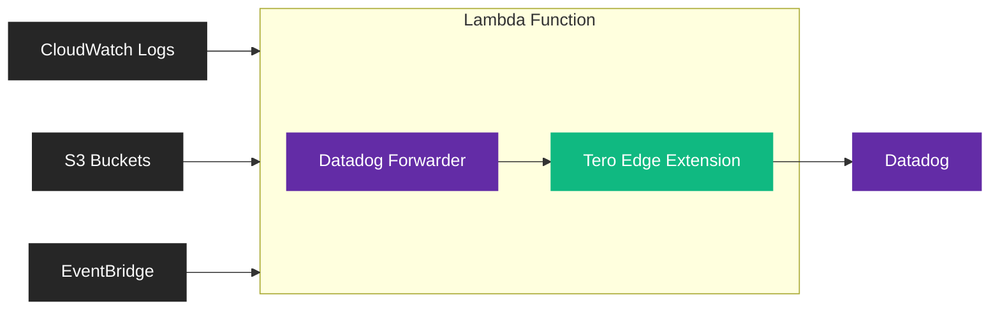

Apply policies to AWS service logs (CloudWatch, S3, EventBridge) before they
reach Datadog using the Tero Edge Lambda Extension.

<Info>
  Looking to filter telemetry from your Lambda functions? See the [Lambda
  Extension](/integrations/datadog-lambda-extension) instead.
</Info>

## How it works

The Tero Edge Lambda Extension integrates with the
[Datadog Forwarder](https://docs.datadoghq.com/logs/guide/forwarder/) to provide
policy-based log filtering. The extension runs as an external Lambda extension
alongside the forwarder, intercepting logs and applying your policies before
forwarding to Datadog.



Use cases:

- Filter CloudWatch logs from EC2, RDS, ECS, and other AWS services
- Apply policies to S3 access logs, ALB logs, or CloudTrail events
- Drop noisy AWS service logs before they're indexed in Datadog

## Prerequisites

- AWS account with logs you want to forward to Datadog
- Datadog account with an
  [API key](https://app.datadoghq.com/organization-settings/api-keys)
- Tero account with an API key

## Quick deploy

Deploy the Datadog Forwarder with Tero Edge Extension using CloudFormation.

<Card
  title="Launch Stack"
  icon="aws"
  href="https://console.aws.amazon.com/cloudformation/home#/stacks/create/review?templateURL=https://tero-public.s3.amazonaws.com/lambda/template.yaml"
  horizontal
>
  Deploy via AWS CloudFormation
</Card>

### Required parameters

| Parameter          | Description                                                                    |
| ------------------ | ------------------------------------------------------------------------------ |
| `DdApiKey`         | Your Datadog API key                                                           |
| `DdSite`           | Your Datadog site (e.g., `us5.datadoghq.com`, `datadoghq.com`, `datadoghq.eu`) |
| `TeroPolicyApiKey` | Your Tero API key for policy sync                                              |

### Tero Edge parameters

The extension is enabled by default. Configure these parameters as needed:

| Parameter              | Default                                   | Description                                                     |
| ---------------------- | ----------------------------------------- | --------------------------------------------------------------- |
| `TeroEdgeLayerVersion` | `4`                                       | Version of the Tero Edge layer. Set to empty string to disable. |
| `TeroEdgeLayerArn`     | (auto)                                    | Override the full layer ARN. Leave empty to use default.        |
| `TeroPolicyUrl`        | `https://sync.usetero.com/v1/policy/sync` | HTTP policy provider URL                                        |
| `TeroPolicyApiKey`     |                                           | API key for authenticating with the policy provider             |
| `TeroPolicyStatic`     |                                           | JSON string for static policies (alternative to HTTP provider)  |
| `TeroListenPort`       | `3000`                                    | Port for the extension proxy server                             |
| `TeroLogLevel`         | `info`                                    | Log level (`debug`, `info`, `warn`, `err`)                      |

<Note>
  The extension automatically configures the Datadog Forwarder to route logs
  through `localhost:3000`. The upstream URL is derived from your `DdSite`
  parameter.
</Note>

## Manual setup

For existing Datadog Forwarder deployments, add the Tero Edge Extension layer.

<Steps>
  <Step title="Create a Tero API key">
    Open your terminal and run:

    ```bash
    tero
    ```

    Navigate to **Edge** → **API Keys** → **Create**. Name your key (e.g., "Lambda forwarder"). Copy the key when shown—it's only displayed once.

  </Step>

  <Step title="Add the extension layer">
    Add the Tero Edge Extension layer to your Lambda function:

    ```
    arn:aws:lambda:YOUR_REGION:242046726909:layer:Tero-Edge-Extension-ARM:4
    ```

    Replace `YOUR_REGION` with your AWS region (e.g., `us-east-1`).

  </Step>

  <Step title="Configure environment variables">
    Add these environment variables to your Lambda function:

    | Variable | Value |
    |----------|-------|
    | `DD_URL` | `localhost` |
    | `DD_PORT` | `3000` |
    | `DD_NO_SSL` | `true` |
    | `TERO_UPSTREAM_URL` | `https://http-intake.logs.YOUR_SITE.datadoghq.com` |
    | `TERO_LISTEN_PORT` | `3000` |
    | `TERO_POLICY_URL` | `https://sync.usetero.com/v1/policy/sync` |
    | `TERO_POLICY_API_KEY` | Your Tero API key |
    | `TERO_LOG_LEVEL` | `info` |

    Replace `YOUR_SITE` with your Datadog site (e.g., `us5` for `us5.datadoghq.com`).

  </Step>

  <Step title="Verify">
    Invoke your Lambda function and check CloudWatch logs for:

    ```
    [INFO] lambda.extension.starting
    [INFO] configuration.loaded logs_url="https://http-intake.logs.us5.datadoghq.com"
    ```

    Confirm logs reach Datadog with policies applied.

  </Step>
</Steps>

## Static policies

For simple use cases, you can embed policies directly in the Lambda
configuration instead of using the HTTP policy provider.

Set `TeroPolicyStatic` (or `TERO_POLICY_STATIC` environment variable) to a JSON
string:

```json
{
  "policies": [
    {
      "id": "drop-health-checks",
      "name": "Drop health check logs",
      "log": {
        "match": [
          {
            "log_field": "body",
            "regex": "GET /health"
          }
        ],
        "keep": "none"
      }
    }
  ]
}
```

<Warning>
  Static policies don't update without redeploying. Use the HTTP policy provider
  for dynamic policy management.
</Warning>

## Environment variables reference

| Variable               | Description                                    |
| ---------------------- | ---------------------------------------------- |
| `TERO_UPSTREAM_URL`    | Datadog intake URL for forwarding logs         |
| `TERO_LISTEN_PORT`     | Port for the extension proxy (default: `3000`) |
| `TERO_LOG_LEVEL`       | Log verbosity: `debug`, `info`, `warn`, `err`  |
| `TERO_POLICY_URL`      | HTTP policy provider URL                       |
| `TERO_POLICY_API_KEY`  | API key for the policy provider                |
| `TERO_POLICY_STATIC`   | JSON string with static policies               |
| `TERO_SERVICE_VERSION` | Version identifier for tracking                |

## Troubleshooting

**Extension not starting**

Check CloudWatch logs for the extension:

```
EXTENSION Name: tero-edge State: Started Events: []
```

If you see `LaunchError`, verify the layer ARN matches your architecture (ARM64
vs x86_64).

**Policies not applying**

- Verify `TERO_POLICY_URL` is set and accessible
- Check `TERO_POLICY_API_KEY` is correct
- Enable `TERO_LOG_LEVEL=debug` to see policy loading logs

**Connection errors to Datadog**

- Verify `TERO_UPSTREAM_URL` matches your Datadog site
- Check the Lambda has network access to Datadog endpoints
- Review extension logs for TLS or connection errors

**Forwarder not routing through extension**

Ensure these environment variables are set:

- `DD_URL=localhost`
- `DD_PORT=3000`
- `DD_NO_SSL=true`

## Disabling Tero Edge

To disable the extension and route logs directly to Datadog:

**CloudFormation**: Set `TeroEdgeLayerVersion` to an empty string.

**Manual**: Remove the Tero Edge layer and unset the `DD_URL`, `DD_PORT`,
`DD_NO_SSL`, and `TERO_*` environment variables.
