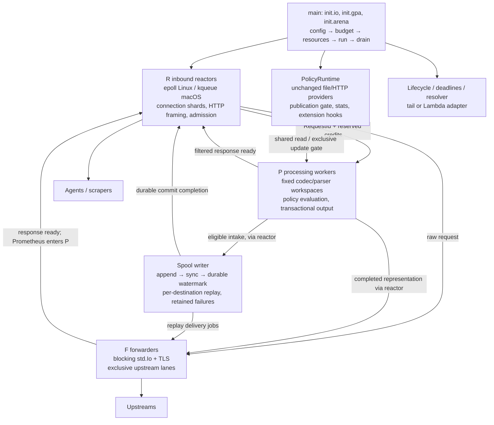

# Tero Edge v2 — from-scratch design proposal

Date: 2026-09-11; status updated 2026-09-17. Target: Zig 0.16.0.
Phase 1 raw HTTP relay is implemented and measured; phases 2–6 remain planned.
Companion: [REDESIGN-NOTES.md](REDESIGN-NOTES.md).
The review findings and source evidence are recorded in that document, §13.

## 1. Summary

Edge filters and transforms telemetry between agents/applications and Datadog,
OTLP backends, or Prometheus scrapers. Tail applies policies to file/stdin
records; the Lambda extension adds the Extensions API lifecycle. Preserve
these six distributions, policy semantics, providers, S3 extension, inspection
endpoints, config inputs, and deployment targets.

The design uses nonblocking inbound reactors, a bounded processing pool, and
bounded blocking upstream forwarders. Connections, requests, and temporary
processing storage have separate owners. A request retains its original
encoded body until its forwarding representation is committed. This enables
whole-request fail-open on processing failures before any upstream write.
Policy publication uses an Edge-owned reader/writer gate around unchanged
`policy-zig` APIs. `zonfig` remains unchanged too.

An optional durable queue accepts selected telemetry intake routes. Success
means that the final upstream request and its recovery metadata have crossed
the durability barrier. Delivery is at least once under stated assumptions;
retries can duplicate data. Relay remains the default and preserves upstream
responses. Scrapes and arbitrary passthrough are never queued implicitly.

Memory owned by the transport and processing core has explicit capacities.
General allocation is absent from the core's steady request path; bounded
scratch allocation is allowed. Policy compilation, dependency internals,
TLS/DNS setup, observability, and S3 buffering need separate accounting. A
process-wide zero-allocation or fixed-RSS claim is not justified with unchanged
dependencies and demand-paged storage.

`main(init: std.process.Init)` owns configuration, allocators, I/O, resources,
thread lifetimes, and shutdown. Pass `io` to effectful operations and allocators
to operations that allocate; pure functions take values and slices. Large
persistent workspaces live in startup allocations, while small operation
records and temporary values live on the stack.

Prior notes report approximately 71k requests/s and 24 MB RSS without policies,
and 55–67k requests/s and 82–87 MB RSS at 4000 policies. These are historical
inputs, not measurements from this review. The original 100k requests/s and
32 MiB-plus-policy-storage objectives remain hypotheses, subject to §8 and §11.

## 2. Goals and non-goals

Goals:

1. Preserve supported behavior in `edge`, `edge-datadog`, `edge-otlp`,
   `edge-prometheus`, `edge-tail`, and `edge-lambda`.
2. Keep config field types, explicit values, env precedence, CLI flags,
   policy providers, accessors, sampling/rate limits, and extension semantics.
3. Bound admitted work and core memory; measure CPU, tail latency, allocations,
   stack high-water, and policy evaluation coverage as well as throughput.
4. Forward original data on recoverable policy-path failure. Distinguish
   resource rejection, intentional policy drops, and transport failure.
5. Never acknowledge durable acceptance and then silently discard the record.
6. Develop by failing tests first, with deterministic ownership, framing,
   publication, deadline, and crash-recovery tests preceding implementation.

Non-goals: HTTP/2 or OTLP/gRPC ingest, a general CONNECT/Upgrade tunnel,
exactly-once delivery, transparent survival of process/host loss in relay
mode, a custom `std.Io` vtable, and patches to `policy-zig` or `zonfig`.

No finite proxy can guarantee delivery through arbitrary upstream outage,
disk exhaustion, client disconnect, or host loss. Fail-open describes policy
bypass, not an ability to bypass failed infrastructure. Return meaningful
errors before response commitment when possible; after commitment an incomplete
exchange must close. An assertion/panic is not a recoverable policy error.

## 3. Architecture

Transport decision (reviewed 2026-09-15): retain the Edge-owned v2 reactor design.
The pinned httpz supports lazy Content-Length reads, but buffers chunked bodies
before dispatch, sends Continue before application admission, and does not retain
request storage after handler return through `disown()`. See the source audit,
executable probes and alternatives in [HTTPZ-TRANSPORT-REVIEW.md](HTTPZ-TRANSPORT-REVIEW.md).
Production continues using httpz until cutover. This choice fits the proposed
ownership contract; its performance benefit remains unmeasured.

### 3.1 Process view



R owns inbound sockets. P owns active codec/parser state. F owns upstream
sockets. The reactor owning a request schedules its next stage; producers do
not mutate another thread's connection state. Spool and provider threads are
additional, explicitly counted resources. A forwarder never evaluates policies;
Prometheus response filtering uses P too. Therefore P bounds concurrent
scanners, including all signals.

Preserve the current effective HTTP defaults: `worker_count = null` resolves
to one reactor and `thread_pool_count = null` to 32 forwarders. The null field
values themselves do not change. `processing_count` is a new optional setting,
initially one, benchmark-tunable up to 64. More cores do not automatically
justify more per-worker scratch or upstream connections. Lambda keeps existing
explicit settings; a smaller profile is opt-in until measured.

### 3.2 Request and response ownership

```mermaid
sequenceDiagram
    participant A as Agent
    participant R as Reactor
    participant P as Processing worker
    participant F as Forwarder
    participant U as Upstream
    A->>R: validated HTTP head, body
    R->>R: retain original body; reserve job/completion credits
    R->>P: request lease
    P->>P: decode, evaluate once, finish candidate output
    P->>R: ready(raw or changed); release processing lease
    R->>F: immutable outbound request lease
    F->>U: request, with absolute deadline
    U-->>F: framed response
    F->>R: response ready; release forwarding lease
    R->>A: response
    R->>R: retire request only when all leases end
```

A client disconnect detaches the connection from its request. It does not free
storage still held by a processor, forwarder, spool writer, or pending
completion. Cancellation requests work to stop; it is not proof that work has
stopped. A queued completion itself retains the request until consumed.

### 3.3 Source layout and useful abstractions

Keep one shared composition root and thin distribution entry points, or build
one `main.zig` with a comptime distribution parameter. Preserve six installed
binary names and the existing package/library surface during migration. File
count is not a design objective.

```text
src/main.zig                  entry and test registration
src/runtime.zig               explicit initialization and teardown
src/config.zig, budget.zig     unchanged config inputs → validated runtime limits
src/os/{epoll,kqueue,fake}.zig  readiness, wakeups, socket ownership
src/http/{head,body,conn}.zig   incremental framing and pure transitions
src/http/{server,client}.zig   reactor driver and upstream HTTP/1.1 transport
src/{request,pool,queue}.zig    handles, leases, credit accounting
src/{route,plan}.zig           comptime routes and pure outcomes
src/pipeline.zig               processing transaction and commit point
src/codec/                    bounded codecs and envelope-aware framers
src/signal/                   Datadog, OTLP, Prometheus accessors/serialization
src/policy_runtime.zig         gated provider publication; unchanged policy-zig
src/forwarder.zig              deadline-bound exchanges and replay decisions
src/spool/                    format, writer, recovery, replay acknowledgements
src/{admin,metrics,observe}.zig inspection and bounded event delivery
src/tail/, src/lambda.zig      source/sink and lifecycle adapters
```

Abstraction boundaries represent ownership or protocol differences: Reactor,
RequestLease, BodyStorage, UpstreamLane, PolicyRuntime, and Spool. Framers use
comptime specialization or tagged unions over a fixed set of formats. Do not
build a generic asynchronous framework or pass a service locator everywhere.
A pure transition returns a small fixed action list, never a heap allocation.

## 4. Data model and allocation discipline

### 4.1 Connection and request tables

Use a shard-local free list and stable indices. Split frequently scanned fields
from payload metadata; compare array-of-structs against hot/cold arrays before
choosing further SoA splits. `MultiArrayList(struct { hot, cold })` splits those
two fields only, not every member inside `hot`. No packed structs for ordinary
runtime state, and no assumed byte size without `@sizeOf` verification.

Illustrative types, not drop-in implementation:

```zig
const ConnId = struct { index: u32, generation: u64 };
const RequestId = struct { index: u32, generation: u64 };
const Hot = struct {
    fd: i32,
    state: State,
    read_len: u32,
    deadline_ms: u64,
};
```

Use an independent wide generation for each reusable object. Retire a slot on
generation overflow. The previous 16-bit generation can wrap during normal
high-churn service life. Generation checks discard stale events; leases prevent
use-after-free. These solve different problems. OS event tokens reference a
stable registration or a verified index/generation encoding; never truncate a
handle to fit `epoll_event.data` or `kevent.udata`.

The phase-1 readiness implementation uses independent nonzero `u64` tokens.
For fixed capacity N, slot i starts at token i+1; reuse adds N with checked
arithmetic. `(token-1) % N` selects the slot, and exact token equality validates
its incarnation. Overflow permanently retires the slot. This needs no hash map,
pointer-bearing event payload, or truncated request generation. Tokens are local
to one poller lifetime; batches cannot survive poller destruction. At N=1 million,
each slot still has about 18 trillion incarnations. Request leases remain separate.

Request metadata owns parsed-head storage and spans, route/upstream choice,
original-body storage, candidate-output storage, response storage, retry class,
stage/deadline, and outstanding leases. Header spans cannot point into a read
buffer reused for the next request. Preserve unread keep-alive bytes; process
pipelined requests sequentially and keep responses ordered.

States include `reading_head`, `waiting_credit`, `reading_body`, `processing`,
`waiting_forwarder`, `forwarding`, `waiting_spool_commit`, `responding`, and
`detached`. Transitions assert ownership and credit invariants, not tautologies.

### 4.2 Body storage and admission

Keep body storage separate from connection slots. Preallocate descriptors and
bounded size classes for small bodies, plus page-rounded large reservations.
Do not reserve the maximum request size for every idle connection. An initial
implementation may use fixed large slots, but the high-water memory budget
must be acceptable with every admitted slot fully touched.

Input, transformed output, and upstream response have different caps and
lifetimes. A `2 × max_body_size` slot cannot hold a 16 MiB response when the
request cap is 1.5 MiB. Never overwrite transformed output with a response while
a retry may still need that output. Model separate pools, and budget their
possible overlap. Small bodies may remain inline only while their storage is
pinned by the request owner.

Reserve input storage and queue/completion credits before admitting a body.
Reserve optional processing output before evaluation; if unavailable, bypass
processing using the original body. Reserve response capacity before starting
a buffered upstream exchange. Each live request can occupy only one stage
queue at a time. Completed jobs always have somewhere to publish completion.

When resources are busy, disable read interest and put the connection on a
bounded fair waiter list. Explicitly resume waiters when credits return. Keep
an absolute admission/request deadline; TCP backpressure does not promise that
the sender will wait forever. At deadline send 503 where possible and close.
A full forwarder queue cannot be repaired by a fictional second relay path.
Reserve a small portion of forwarding and connection capacity for raw fallback
and health/admin work; exhaustion still has an explicit response.

The phase-1 `Connections` implementation owns fixed head buffers and metadata
alongside `Readiness`. Its intrusive FIFO has at most one waiter per connection;
disconnect unlinks a waiter in constant time. Every completed head joins the tail,
including a keep-alive request, even when capacity is currently available. Each
admission call grants one request slot and one `WorkChannel` credit together.
The eventual reactor limits grants per turn and retries on resource returns.
FIFO covers eligibility for admission, not worker completion order or tenant
fairness. Admission deadlines and reserved health/fallback capacity still need
runtime wiring before this path can serve traffic.

Request slots retain the originating connection's full token through disconnect
and completion. This permits direct completion routing without a separate map
and prevents a reused socket slot from receiving an old response. Completion
acknowledgement releases queue credit; response storage stays pinned for a live
client until the response write finishes. Disable socket interest before job
publication so a native failure cannot make a published job look unsubmitted.
Complete acknowledgement before arming response writes; a later interest failure
closes the client without acknowledging the same completion twice. Connection
head bytes remain separate from worker spans so the framer can preserve unread
keep-alive bytes. Local replies and actual HTTP parsing remain later work.

Use the actual platform page size for mmap/madvise boundaries. Release only
fully unowned pages. Linux anonymous `MADV_DONTNEED` and macOS reclamation have
different guarantees; RSS reclamation is best effort and measured separately.
The old 64 KiB reclaim threshold is a benchmark variable, not a correctness
constant. Page faults, OS overcommit, and cgroup OOM can defeat lazy reservation;
size admission for committed high-water, not idle RSS.

### 4.3 Per-processing-worker workspace

| Storage | Bound and ownership |
|---|---|
| Decompressor | Configured maximum zstd window plus required block/history buffers; gzip separately sized |
| Record bytes | Initial 256 KiB cap; oversized policy units stay raw |
| Record allocator | Fixed backing buffer, initially 1 MiB, reset only after all borrowed values are consumed |
| JSON parser | Explicit capacity including SIMD padding and structural indices; reject growth beyond workspace |
| Encoder | Codec state plus staging; std flate state alone is approximately 224 KiB |
| Match IDs | `max_matches_per_scan` (256) slices, consumed/copied under the policy read guard |
| C codec state | Budget libzstd context growth separately; do not assert a Zig allocator can observe C malloc |

`ArenaAllocator.reset(.retain_with_limit)` limits retained memory, not peak
allocation. Use `FixedBufferAllocator` directly, or an arena whose backing
allocator is fixed and cannot grow. Scratch OOM abandons candidate changes and
keeps original bytes. Audit whether unchanged dependency code catches an error
internally before claiming every allocation failure is observable by Edge.

Keep small parsed values, handles, iovecs, and operation descriptors on the
stack. Store large codecs, record buffers, TLS buffers, and engine workspace
where their lifetime and maximum size are explicit. Initialize objects with
self-references in their final address and do not copy them. A 256 KiB thread
stack is not safe by assertion: std flate state plus policy/protobuf frames can
exceed it. Set stack sizes only after call-depth/high-water tests in Debug and
ReleaseSafe, with guards and margin.

### 4.4 Upstream lanes

Each forwarder exclusively owns its active stream and a bounded number of idle
lanes. Key lanes by scheme, authority/port, TLS verification identity, and
applicable connection options, not merely a byte-sized route ID. Retire lanes
on framing/transport errors, unexpected EOF, configured age/request count,
`Connection: close`, or endpoint refresh. Exclusive ownership removes concurrent
pool reuse races; it cannot prevent a peer closing an idle socket.

### 4.5 Unchanged policy-zig integration — correctness gate

Initially verified against `policy-zig` 0.7.1 and then the merged
[#96 ownership fix](https://github.com/usetero/policy-zig/pull/97), commit
`a652ae9573ca9f318fc1bf6c60b1abe8240bc160`. The user has authorized the local
`../policy-zig` dependency until its follow-up fixes are merged.
`getSnapshot()` returns an atomic
pointer, snapshots retire after 100 ms or pending-list pressure, and
`evaluate()` borrows that snapshot internally. A short expected evaluation time
is not a lifetime proof; a reader can be descheduled. Old policy data also must
remain valid across provider replacement. Do not use unguarded snapshots.

Add `PolicyRuntime` in Edge using public `FileProvider`, `HttpProvider`,
`Provider.subscribe(PolicyCallback)`, `Registry.updatePolicies`,
`Provider.setStatsCollector`, and `Provider.setExtensionSyncHooks` APIs:

1. Construct unchanged providers but supply Edge's callback instead of calling
   `Registry.subscribe` or `Loader.startAsync`, which install ungated callbacks.
   Reproduce the loader's configuration/lifecycle wiring, not provider logic.
2. The callback takes an Edge-owned `std.Io.RwLock` exclusively before any
   registry mutation, including static updates and provider removal. Provider
   fetch/parse stays outside this gate; update/compilation stays inside it.
   Updates are synchronous within the callback, so provider-owned policy slices
   remain alive. Do not enqueue borrowed update pointers.
3. Processing workers acquire a shared guard for a buffered request's evaluation pass.
   Keep it through prefilter checks, all evaluations, and consumption of borrowed
   policy IDs/extension bindings. No snapshot pointer crosses a queue boundary.
   Admin snapshot reads use the same guard and copy results before releasing it.
4. Do not wait through a compilation pause: if the shared guard is unavailable,
   forward the original request and count `policy_update_busy`. Bound request
   work so readers drain and writers make progress. This trades temporary
   filtering coverage for availability during updates, explicitly.
5. Wire stats collection, volume draining, capabilities, extension config
   application, final provider `close()`, and provider teardown through the
   adapter. Define one lock order: Edge gate before registry mutex; never
   acquire the Edge gate while holding the registry mutex. Stats collection
   takes the shared guard before `Registry.collectStats`, which loads a snapshot
   before taking its own mutex. Gate extension
   configuration changes too, after auditing callback/extension lock order.

This permits parallel readers without changing library memory reclamation.
The gate must cover every mutator and every snapshot consumer. Test provider
callbacks, admin reads, failure unwinding, and teardown before performance work.
Do not replace the gate with an assumed 100 ms scheduling guarantee.

**Update failure is a separate hazard.** The pinned registry replaces/frees
policy data before fallible snapshot construction finishes; the outer gate
does not make that operation transactional. If an update returns an error,
mark the policy runtime unavailable while still holding the exclusive guard.
Subsequent evaluations bypass policy, stats/admin return an explicit degraded
view without dereferencing that registry, and further updates do not touch it.
Quarantine its allocation ownership until process exit; do not assume calling
`deinit` on a partially mutated dependency object is safe. This is a bounded
single-failure retention, not an unlimited sequence of leaked rebuilds. Recover
policy service through a controlled restart with fresh providers; transport
continues raw meanwhile. Last-good transactional rebuilds would require an
additional proven integration and memory budget, not an assumed library property.
Phase 0 must fault-inject these paths and verify the adapter can observe errors
before any unsafe dependency access. A dependency-internal panic remains outside
the process's recoverable failure contract.

**Implementation evidence (2026-09-14):** the local dependency now passes the
publish/replace/duplicate/remove fault sweep, direct cleanup checks, plain-arena
alignment, and the additional typed-byte/invalid-hex reproductions. The former
double-free hang, matcher ownership leaks and temporary-pattern alignment failures
are resolved for these fixtures. No non-failing reserve allocator or alignment
adapter is required for them. Keep failure fencing: cleanup fixes do not make
publication transactional. Regex-engine OOM and native C allocation accounting
remain outside the verified fixture. See `IMPLEMENTATION-PROGRESS.md` for current
dependency selection, reproducible evidence and process-owner recovery work.

Only P workers evaluate, with P ≤ 64 across all signals. This avoids exceeding
the dependency's 64 scanner slots; it does not prove absence of contention.
Regex redaction uses a mutex and extension sinks can allocate or lock. These
facts are why processing is not on the reactor. Engine `evaluate()` returns a
`PolicyResult`, not an error union; adapter errors and dependency-reported
failures must be distinguished. There is no Zig panic guard.

## 5. Threads and the OS

### 5.1 Inbound reactor

Use level-triggered epoll on Linux and kqueue on macOS initially. Limit accepts,
read/write bytes, completions, and ready connections per turn so one busy peer
cannot monopolize the loop. Retry EINTR; handle EAGAIN as normal; preserve
partial read/write offsets. Test half-close, reset, hangup with pending bytes,
stale events, and accepted-socket handoff failure.

On Linux, optional per-reactor `SO_REUSEPORT` listeners distribute connections;
they do not balance the request load of persistent connections. On macOS use a
single acceptor and bounded socket handoff initially. Create descriptors with
close-on-exec and nonblocking flags atomically where supported; platform wrappers
provide the fallback. Set TCP_NODELAY after measuring small-payload behavior.
Treat TCP_DEFER_ACCEPT as a Linux tuning option. Preserve current RLIMIT_NOFILE
handling, but calculate actual demand from inbound/outbound/spool/control fds.
Handle EMFILE without a busy loop, using a reserve descriptor if useful.

The initial `Acceptor` uses one listening socket and a fixed `AcceptChannel` per
reactor on both platforms. Each turn counts every accept syscall, including
EINTR and aborted accepts, against its budget. Successful accepts probe targets
round-robin, skipping full/closed queues; at most 64 targets are allowed. Enqueue
success transfers the descriptor's close duty to the queue. If every target
refuses it, the acceptor closes it without acknowledging any request. Reactor
drains are also bounded and schedule another immediate turn on budget exhaustion.
`Connections.adopt` consumes each dequeued fd even if its connection table is full.

Linux uses `accept4(CLOEXEC | NONBLOCK)`; macOS applies flags before handoff.
The listener has a read-only readiness registration. Resource exhaustion disables
that registration for a configurable backoff (initial default 50 ms), while the
control wake remains enabled. Waiting is capped by the retry deadline; expiry
reenables level readiness. A failed pause/resume registration stops acceptance
and reports the control error. This favors a small timed retry over a reserve-fd
recovery mechanism for now; measure behavior under descriptor pressure before
adding the latter. Wake failure after handoff leaves queue ownership intact and
requires finite reactor waits. All such failures remain visible in turn reports.

Stop/join acceptance before destroying target queues or wake objects. Queues
close pending descriptors at teardown; closing a queue during production rejects
later offers while preserving earlier successful handoffs. Account separately
for all queued fds, active connections, listener/poller/wake fds and the acceptor's
one transient accepted fd. Queue bytes are bounded application memory; kernel
backlog and socket buffers are additional resources. The serving composition must
bind these counts, accept/drain budgets, and retry timing to validated config.

Use scatter/gather writes for stable header/body slices. Arm write interest only
when output is pending. A wakeup is a hint, not a completion record: publish
queue entries with release ordering, wake eventfd/EVFILT_USER, and drain with
acquire ordering. Test coalesced wakes and the sleep/producer race. A full
completion channel must not lose ownership-release events.

`Readiness` owns adopted socket descriptors, including adoption failure; callers
must relinquish the fd when calling `adopt`. A failed interest update closes and
invalidates that registration because kqueue may have applied only part of the
change. Registered descriptors cannot be duplicated or closed elsewhere. Join
wake producers before destroying the poller. Raw readiness syscalls are isolated
in `v2/os/Poller.zig`; the dedicated reactor passes `std.Io` for its awake-clock
deadline. Native waits use explicit wake/shutdown state rather than implicit
`Io` task cancellation. Recompute remaining time after EINTR.

Wake consumption and bounded completion draining are separate. If a completion
budget is exhausted, schedule another immediate turn and inspect the queue again;
do not wait for another wake. Linux consumes one aggregate eventfd counter per
reported wake, with saturated writes treated as an already-pending wake. All
blocking reactor waits must have a finite deadline so a failed producer wake
cannot strand published completions indefinitely. The composition phase must
choose that maximum fallback interval and report wake/poller failures.

`Io.Queue.put(..., min = 0)` avoids waiting for free queue capacity, but is not
a blanket lock-free/wait-free claim about implementation or I/O callbacks.
Start with fixed queues and measure contention; use per-worker SPSC rings if
reactor queue locking creates material stalls. Do not busy-spin on saturation.

### 5.2 Forwarders, DNS, TLS, and deadlines

Forwarders perform blocking `std.Io` networking and std TLS, with one exchange
at a time per forwarder. This bounds active upstream concurrency to F.
Throughput is therefore at most roughly `F / mean_exchange_seconds` before
CPU costs: 32 forwarders at 0.5 ms are about 64k requests/s, and at 10 ms about
3.2k. This design removes per-connection stacks, but does not by itself remove
the throughput ceiling identified in the earlier rewrite. Benchmark a larger
F against stack/RSS cost before promising 100k end-to-end requests/s.

Resolve names through a bounded control-plane service with cached address sets,
refresh, negative-cache limits, and a deadline. DNS never runs on a reactor.
The std lookup queue-capacity guarantee concerns queue insertion, not bounded
DNS latency. Preserve hostname verification, SNI, trust bundle loading, IP
literal behavior, and certificate time checks; never fail open by disabling TLS
verification. Rebuild trust material off-thread and pin it while used.

An exchange deadline covers queue wait, resolution, connect, TLS handshake,
request writes, response reads, and retries. Kernel SO_RCVTIMEO/SO_SNDTIMEO
bound individual blocking calls, not a whole request: a trickling peer can
reset progress indefinitely. Carry an absolute monotonic deadline and pass
remaining time to each transport operation. If std TLS's nested I/O cannot
honor it directly, retain a lifecycle deadline manager that shuts down the
active socket. Synchronize registration/removal with socket close/reuse so a
watchdog cannot touch a recycled fd. The forwarder remains the only closer.
DNS/control operations need their own cancellable or deadline-bound implementation;
shutting down a socket does not cancel DNS. Test this boundary in phase 0.

Record retry facts separately: original bytes retained, request bytes sent,
response begun, and route's duplicate tolerance. Buffered does not mean safe to
retry. Preserve current route retry eligibility, including raw versus processed
outcomes. Retry at most once in relay mode within the original deadline where
eligible; a transport failure after send has an ambiguous upstream outcome.
Do not retry generic non-idempotent passthrough or policy evaluation itself.

### 5.3 Spool and durability contract

The spool is opt-in by an allowlist of tested intake routes. Start with log
intake routes whose callers tolerate retries. Other intake routes require an
explicit duplicate-tolerance decision and protocol success fixture. Prometheus,
admin, health, and generic passthrough always remain relay/local operations.
Use protocol-appropriate success responses: do not impose 202 universally.

Durable mode acknowledges only after the complete final upstream request and
required recovery metadata are durable. Group commit still waits for the group
barrier before acknowledging every member; `sync_interval_ms` adds bounded
batching delay, not an acknowledged-loss window. If a weaker unsynced mode is
ever added, name it best effort and report its crash-loss window separately.

The spool holds the representation chosen by processing, or original encoded
bytes after fail-open. A policy that intentionally drops every record can
succeed locally without an upstream record. Spool replay never reevaluates
policies, sampling, transforms, or S3 dispatch; changed policies cannot rewrite
already accepted data. Policy stats and S3 side effects are not atomic with
spool acceptance and may precede an ultimately failed append.

Write and recovery protocol:

1. One writer owns append offsets. Create private files under an exclusive
   spool-directory lock. Use buffered positional I/O and group sync first;
   preallocation is optional and its errors are handled. Reserve total space
   including metadata and retained failures before committing an append.
2. Use an explicitly encoded, versioned format with fixed byte order: segment
   identity, sequence, bounded lengths, destination identity, metadata length,
   payload length, and checksum covering routing metadata plus bytes. No raw
   struct dump, pointer, fd, or process-local UpstreamId on disk. Persist the
   destination URL/path and necessary headers or a durable versioned reference;
   changed config must not silently redirect a queued request.
3. Complete short writes, sync the segment, then atomically publish and sync a
   manifest containing the committed high-water mark. Make new directory entries
   durable before acknowledging. Only then publish commit completions. Serialize
   append/manifest updates; errors leave requests unacknowledged and put the
   writer into a recoverable degraded state. Platform barrier semantics need
   testing, including macOS power-loss requirements if claimed.
4. Recovery validates the manifest and scans bounded lengths/checksums in order.
   An incomplete uncommitted suffix can be truncated; a corrupt committed record
   or sealed segment is retained and stops that lane with an alert. Never skip a
   CRC failure and declare success. Preallocated zero tails are not records.
5. Replay one in-flight record per destination lane initially. After successful
   upstream acceptance, persist that lane's delivery cursor. Crash before cursor
   sync can duplicate delivery. Delete a segment only after all its records have
   durable delivery or retained-failure state; sync deletion metadata as needed.
   Segments with holes remain until every relevant record is accounted for.

429, protocol-specific retryable statuses, 5xx, and transport ambiguity follow
a documented retry classifier with Retry-After and bounded jittered backoff.
Do not treat every 4xx as permanent: auth failures may recover. Definitive
rejections go to a durable retained-failure lane with payload, reason, and an
explicit inspect/retry/purge operation. No automatic deletion of acknowledged
records. Per-destination lanes prevent one broken destination blocking all
others; replay cannot starve live relay requests.

If full or unavailable, attempt synchronous relay while retaining the request
and its deadline. A successful upstream response satisfies the caller; if
neither storage nor upstream succeeds, return an error, never synthetic success.
After an ambiguous append failure, recovery and a relay/client retry can create
duplicates. Internal append IDs make spool recovery unambiguous; they cannot
create end-to-end deduplication without upstream support.

Guarantee: acknowledged queued records remain recoverable on surviving local
storage and are retried until delivered or explicitly retained for intervention.
It assumes working storage/barriers, the spool directory surviving restart,
and eventual upstream acceptance for eventual delivery. Ephemeral container
filesystems, pod replacement without a retained volume, and Lambda sandbox
destruction do not satisfy that storage-survival assumption. Disk encryption,
permissions, and credential retention must match the persisted payload contract.

Do not share a new record format with tail's existing checkpoint WAL merely
because both use CRCs. Share small tested I/O/checksum helpers where suitable;
keep migration and recovery contracts separate.

### 5.4 Signals and shutdown

Keep SIGIO/SIGPIPE ownership with `Io.Threaded`. Prefer the current dedicated
signal-wait pattern for INT/TERM and normal-thread wakeups; account for any
existing internal USR1 use. A signal handler must not call kevent or arbitrary
Zig I/O/logging. Diagnostic crash handling is best effort, not fail-open.

First signal stops admission and starts an absolute drain deadline. Continue
reactor completion processing while workers finish; joining workers before
draining completions can deadlock. At deadline request cancellation/shutdown,
retain storage until workers relinquish leases, and leave undelivered durable
records on disk. Close providers for final stats, flush S3 within the deadline,
stop/join provider threads, then deinitialize registry, extensions, workspaces,
and I/O. An enforced process-exit deadline may interrupt cleanup; do not free
objects while unjoined workers can access them. A second signal exits promptly.

### 5.5 OS optimizations and portability

Use epoll/kqueue, TCP flow control, scatter/gather I/O, page-aware reclamation,
file notifications, and group sync before exotic mechanisms. `sendfile` is an
optional plaintext spool optimization; TLS needs userspace buffers with current
std TLS. Handle partial sendfile and unsupported-file fallbacks. Benchmark
sequential pread against mappings; mapped-file corruption/truncation can fault.

io_uring availability depends on kernel, security policy, and operation support.
Do not assume its absence solely from Lambda/Fargate branding or its presence
from kernel version. Probe in deployment tests; epoll is the Linux default.
An io_uring backend changes buffer ownership and completion semantics, so it
needs explicit cancellation/late-completion tests, not just a readiness-interface
swap. Keep it out of initial scope and do not advertise an unimplemented
`io_engine=uring` as an available proxy backend.

## 6. Request processing

### 6.1 Planning and compatibility inventory

`plan(distro, method, path, headers)` is pure and yields local response,
raw relay, processed intake, or response-filtered scrape. Use explicit types
for every outcome field. Preserve base-path joining, query strings, per-route
upstream selection, and raw/processed retry distinctions from today's code.

| Surface | Required behavior |
|---|---|
| GET `/_health` | Existing local health response; remains responsive under policy/upstream load |
| POST `/api/v2/logs` | Datadog log policy/accessor/transform behavior; logs upstream |
| POST `/api/v2/series` | Datadog metrics object envelope; metrics upstream |
| POST `/v1/logs`, `/v1/metrics`, `/v1/traces` | OTLP JSON/protobuf; resource/scope fields, sampling and trace-state writeback |
| GET `/metrics`, `/metrics/*` | Filter upstream response; preserve HELP/TYPE and configured cap semantics |
| All other HTTP routes | Default-upstream passthrough in every HTTP distribution, including focused binaries |
| `/_edge/metrics`, `/_edge/policies`, `/_edge/tap/*` | Existing metric names, policy inspection, tap gating/409 rule and 8 MiB cap |
| File/HTTP/static policies | Current priority, reload, stats, volume, extension hooks and shutdown flush |
| S3 dump | Existing target/env configuration, pre-transform selection, dropped-record capture, flush behavior |

Focused-distribution passthrough is verified in `src/runtime/distro.zig` and
`src/service/passthrough.zig`. The previous proposal's focused 404 assumption
was incorrect. Preserve method/path precedence and tap-disabled 404 separately.

### 6.2 Transactional processing and format boundaries

Retain the original encoded entity body, independently of HTTP transfer
framing. Decode through bounded windows and build candidate output privately.
Do not send candidate bytes upstream until framing, processing, serialization,
and compression finish successfully. Before that commit, any structural failure
can choose the untouched input. This does not require byte-identical chunk sizes
or header ordering; entity bytes and end-to-end semantics are preserved.

Bound compressed bytes, total decoded bytes, advertised zstd window, record
size, nesting, element counts, and transform expansion separately. A small
compressed request can require a large history window. If a processing bound is
exceeded, forward encoded input without further decompression. This is an
intentional fail-open improvement over today's decoded-size 413/codec 400 paths;
the raw transport size limit remains a 413 boundary.

A fixed decode window cannot hold arbitrary nested JSON envelopes. Implement
and test per-format structure preservation:

- Datadog logs: array elements are record units; preserve separators and strings
  split across chunks. Datadog series: preserve all object fields around the
  `series` array, not just the selected field.
- OTLP JSON: retain resource/scope context for evaluation, independent of member
  order. Process a bounded resource envelope with the existing nested accessors
  initially. If it exceeds the workspace, retain it unfiltered. Streaming deeper
  requires a context-preserving transducer and tests for shared resource/scope
  mutations; it is not achieved merely by calling `Scanner.skipValue`.
- OTLP protobuf: preserve unknown top-level fields and recompute enclosing
  length prefixes after changes. Current resource-submessage framing is a
  compatibility starting point. Large groups cannot silently disable evaluation
  of most real traffic: measure oversize bypass rates and tune the workspace or
  add finer framing before cutover.
- Prometheus: sample decisions must keep consistent metadata and never emit a
  truncated line as a successful sample. Overlong lines are passed intact where
  framing remains trustworthy. No silent long-line truncation.

No-policy fast path skips decode only after a safe signal-index check and still
accounts for required request/volume observability. Evaluate stateful policy
logic once: no second pass that resamples or double-counts. Candidate encoding
may happen before discovering that all records are unchanged; forwarding input
then avoids the wire rewrite, but does not retroactively eliminate encoding CPU.
A lazy changed-prefix encoder is a later optimization with bounded bookkeeping.

All-dropped OTLP returns a valid success response: HTTP 200 with an empty
protobuf message for protobuf, or `{}` for JSON, and the matching content type.
An unset `partial_success` represents full success; intentional policy drops
are not OTLP rejected records. Thus today's JSON `{}` is not inherently invalid.
Datadog local success must match fixtures from supported clients. Relay otherwise
preserves the real upstream response, including OTLP partial success.
[OTLP response semantics](https://opentelemetry.io/docs/specs/otlp/).

### 6.3 Fail-open matrix (normative)

| Condition | Result |
|---|---|
| No policy, unsupported content type/encoding | Raw entity body to selected upstream |
| Decode/checksum/framing error or decoded/window/work limit | Abandon candidate and forward whole original buffered body |
| Isolated malformed/oversized record with reliable envelope | Keep that record's original bytes |
| Accessor/serialization/scratch failure | Undo candidate record changes; whole-body fallback if envelope/output cannot be completed |
| Policy publication gate busy | Raw body, count bypass reason |
| Output capacity unavailable/overflow | Raw body; never mix partially rewritten output with an uncertain suffix |
| Processing queue full | Bypass policy if forwarding credits exist; otherwise bounded admission wait |
| Input/connection/forwarding capacity full | Bounded backpressure, then 503 when a response is possible |
| Invalid/ambiguous HTTP framing | 400 and close; HTTP is not bypassed as opaque policy input |
| Head/header count too large | 431 and close |
| Raw body exceeds configured transport limit | 413 and close after bounded handling |
| Upstream connect/transport failure | Eligible bounded retry, then 502 before response commitment |
| Absolute upstream deadline expires | 504 before response commitment |
| Buffered upstream response exceeds cap | 502 before response commitment |
| Client disconnect or failure after response commitment | Close; no claim that a new status can be sent |
| Spool cannot durably commit | Relay if possible; otherwise error; no durable success |
| Shutdown | Drain accepted work within deadline; reject new admission |
| Panic, memory corruption, process/host termination | No in-process fail-open guarantee; durable recovery and client retry are separate |

For buffered Prometheus responses use the same whole-response rollback rule.
Existing scrape cap value `0` means unlimited and cannot map silently to a
16 MiB cap. Support that setting with bounded streaming channels and record-level
commit semantics: preserve complete framed lines on local policy failure; after
response bytes are sent, whole-response rollback is impossible. Terminate an
unrecoverable transport/framing failure visibly instead of inventing missing
bytes. Keep finite configured truncation behavior at complete-line boundaries,
count it, and announce it in a header when known before response commitment.
This streaming variant requires its own tests and is not covered by the
buffered guarantee. Acquire the policy read guard per complete streaming record,
release it before channel/network waits, and permit policy versions to change
between records. Fair scheduling and channel credits apply in both directions;
streaming scrapes must not occupy every processing slot indefinitely. Bound
their concurrency/duration and reserve capacity for intake, or suspend their
state explicitly between work turns.

### 6.4 HTTP protocol contract

The phase-1 request-head implementation is `src/v2/RequestHead.zig`, separate
from the incremental delimiter scanner. It validates a complete bounded head,
stores relocatable offsets, and leaves body admission and all writes to the
runtime. Header descriptors use caller-owned storage. Unknown content encodings
and repeated end-to-end fields are retained without decoding or coalescing.

Initial acceptance choices: require one nonempty Host in HTTP/1.1, reject repeated
Host/CL/TE and comma-list CL even when values agree, and support only a single
`chunked` transfer coding. Accept HTTP(S) absolute targets, origin targets,
OPTIONS `*`, and syntactically valid CONNECT authority targets; recognition does
not enable tunneling. Preserve encoded path/query bytes. HTTP/1.0 exchanges close
after the response. Continue is a pure decision gated on body/queue reservation;
runtime wiring must also enforce admission deadlines and send it at most once.

The phase-1 `BodyFramer` consumes no-body, Content-Length and chunked entities
over caller-provided body, line, trailer and descriptor storage. It retains
encoded entity bytes exactly; it does not decode Content-Encoding. Chunked output
is provisional until the zero-size chunk, complete validated trailers and final
CRLF arrive. Failure or early EOF fences the instance permanently so a prefix
cannot be forwarded as a valid request. It returns exact consumed byte counts,
leaving a pipelined request untouched. Output exhaustion stops before consuming
any entity byte that lacks room in the caller's body buffer.

Chunk length uses checked u64 hexadecimal arithmetic. The configured body limit
applies to aggregate decoded transfer-framing bytes; line/trailer framing work
has a separate cumulative metadata budget. Chunk extensions support bounded token
and quoted-string syntax. Trailer fields retain ordering and duplicates as offsets
into the supplied trailer store. Reject framing, routing, connection and critical
representation/authentication trailers. Later header rewriting must also reject
any field nominated by a received Connection header and apply field-specific
trailer rules before forwarding. No body storage, queue credit, timeout or socket
write is allocated/changed by the framer.

`RequestIngress` wires this parsing contract to the existing FIFO admission
ownership: only an already reserved request slot receives copied head/body bytes;
then `Connections.dispatch` publishes the job. The reusable connection head is
never exposed to workers. Every ingress access checks the live generation,
attached reading state and reserved lease before touching request bytes. Dispatch,
cancellation and disconnect revoke that access even while a worker keeps the
slot alive. Parsed descriptors and chunk-line scratch are reactor-local; worker
jobs borrow immutable raw head, entity-body and trailer spans from RequestTable.
Trailer storage is reserved separately from body and response capacity, included
in the checked startup budget, and pinned through completion acknowledgement.
Chunked trailers include their final CRLF; forwarding still requires validated
header/trailer rewriting and output framing. A real reactor loop still must
handle read offsets, peer closure, deadlines and a one-time Continue write.

`RequestWire` prepares raw outbound HTTP/1.1 messages in caller-owned head/tail
buffers, with the original encoded body borrowed between them. Preparation must
succeed before exposing any bytes to an upstream. It regenerates the selected
Host and actual framing, strips fixed hop-by-hop fields and all Connection-named
fields from both metadata sections, and retains ordered end-to-end duplicates.
Chunked input becomes one data chunk plus separate validated trailers; an empty
body emits only the terminal chunk and trailers. A generated Trailer declaration
names the retained trailer fields. Via records the received protocol version.
Expect is consumed locally; unsupported expectations and CONNECT are rejected.

The three spans permit partial writes without copying the body. The cursor
advances only over bytes accepted by the transport; it grants no retry authority.
Source metadata and descriptor scratch can be reused after preparation, while
output buffers and request body stay pinned until sending ends. Input/head/tail
capacities and generated field counts are checked, including the default 64-field
and 16 KiB output-head limits. Reserve up to 18 extra head-buffer bytes for the
chunk size line; tail worst-case capacity is input trailer capacity plus trailer
field count plus five framing bytes. Composition must budget these per active
forwarder and leave space for generated metadata rather than assume that every
maximum-sized input head fits an equally sized output head. This component handles
the unchanged original entity; transformed-body encoding/validator rules belong
to the later policy pipeline. It performs no network IO or route selection.

`ResponseHead` applies strict status-line/field validation with relocatable
metadata. Unknown content encodings and repeated fields remain opaque. Declared
representation length is separate from body framing: HEAD and 304 end at the
head while retaining their Content-Length metadata; 1xx/204 reject prohibited
framing fields. A 205 must contain zero content but still consume its declared
framing. 101 and successful CONNECT tunnels are unsupported. Duplicate or
ambiguous lengths fail instead of normalizing them. Transfer coding is currently
limited to single chunked; other transfer codings require an explicit compatibility
decision before cutover, while Content-Encoding is preserved verbatim.

`ResponseIngress` borrows fixed head/body/line/trailer/descriptor stores, reuses
the scanner and BodyFramer, and exposes a final response only after complete
framing. It stops at each informational head so the owner can rewrite/forward it
before the next feed reuses that store. Both count and aggregate head bytes are
bounded. Explicit clean EOF completes a close-delimited body; transport failure,
deadline cancellation and TLS truncation fence the receiver. Connection reuse is
only a framing precondition: the transport owner must also validate request state,
watchdog result, transport health and read-ahead. This buffered path does not
implement the separate unlimited Prometheus streaming contract.

`ResponseWire` prepares complete raw final responses before publishing completion.
It copies status/reason and retained metadata into request-owned response head/tail
regions; the receiver writes the body directly into the reserved response body.
There is no second body copy for completion. Connection nominations are removed
from headers and trailers, ordered repeated end-to-end fields remain intact, and
framing/Via are regenerated. Without retained trailers, use Content-Length for
ordinary complete bodies; HEAD/304 retain representation lengths and 204 has no
framing fields. With retained trailers, generate one data chunk and a separate
terminal chunk/trailer section. HTTP/1.0 closes and currently rejects retained
trailers before commitment because it cannot carry this framing faithfully.

RequestTable budgets independent response head/body/tail capacities. Head/tail
capacities default to zero for callers using the existing contiguous response
outcome; serving composition must set them explicitly. Budget the output-head
limit plus up to 18 chunk-prefix bytes, and input trailer capacity plus trailer
field count plus five framing bytes for the tail. Generated fields count toward
the head limits. `framed_response` carries scalar lengths/close state through
WorkChannel. Workers stop touching request bytes after publication; the reactor
obtains a response cursor only after acknowledging a live completion. Storage
stays pinned until the response ends, and a detached completion recycles without
writing. Partial writes traverse the three spans without copying. The runtime
must honor the close flag and discard the cursor before releasing the slot.
The phase-1 `Relay` now wires these spans to real socket reads/writes and honors
close/release ordering. Informational responses use a bounded prefix in the same
request-owned head region and are sent before the final HTTP/1.1 response; 100 is
handled locally and HTTP/1.0 receives no 1xx. This deliberately delays Early Hints
until final validation. Transformed metadata still belongs to the policy pipeline.

Own only the HTTP/1.1 transport needed for opaque proxying. Reuse appropriate
std parsing helpers after checking their acceptance behavior; fuzzing alone is
not proof of conformance. Reject conflicting Content-Length, CL/TE ambiguity,
invalid chunk syntax, overflowing lengths, forbidden controls, and obsolete
folding. Correctly handle chunk extensions/trailers, Expect: 100-continue after
admission, bounded informational responses, HEAD, 204/304, connection-close
responses, and EOF before declared length. Preserve extra read bytes for the
next message. These require tests on both legs.
[RFC 9112](https://www.rfc-editor.org/rfc/rfc9112.html).

Strip hop-by-hop headers on both legs, including every field named by Connection
tokens, not just a fixed blacklist. Regenerate Host for the selected authority
and Content-Length/Transfer-Encoding for the actual framing. Preserve repeated
end-to-end fields, query bytes, and credentials required by the route. Treat
trailers explicitly; do not silently lose end-to-end metadata when dechunking.
After rewriting, remove or recompute stale representation validators/digests;
keep Content-Encoding truthful. Test 64-header and 16 KiB-head boundaries with
reserved room for generated fields. Never silently truncate a response header
set and report it as intact.

## 7. Configuration

Use current zonfig loading/deinit, precedence, `${VAR}` interpolation and escaping,
validation hooks, and Lambda's existing JSON-in-env adapters. Freeze input schemas
where possible and derive a separate `RuntimeLimits`. New fields have defaults
and optionality that zonfig already supports; no library changes are needed.
Do not silently clamp explicitly requested thread counts to 64: limit evaluating
workers to 64, but preserve valid reactor/forwarder settings or return an explicit
unsupported-resource diagnostic with migration guidance.

Proposed additions (names subject to schema fixtures):

```json
{
  "processing_count": null,
  "max_inflight_requests": null,
  "record_arena_bytes": 1048576,
  "upstream_timeout_ms": 30000,
  "max_response_body": 16777216,
  "spool": {
    "enabled": false,
    "routes": ["datadog_logs", "otlp_logs"],
    "dir": ".tero/spool",
    "max_bytes": 1073741824,
    "segment_bytes": 67108864,
    "sync": "group",
    "sync_interval_ms": 100
  }
}
```

Derived request admission must account for all input/output/response reservations,
not simply `16 bodies × reactor_count`. Validate multiplication/addition overflow,
page alignment, segment versus record size, FD demand, deadlines, and settings
where the promised memory ceiling cannot fit a single request. Log resolved
capacities and changed effective defaults explicitly.

Validate parsed URLs for supported scheme, valid authority, and port. An empty
interpolated variable can still yield a syntactically valid but unintended URL;
rejecting `..` cannot reliably detect this and can reject legitimate paths.
If strict missing-variable detection is added, inspect template/env inputs before
zonfig using its escaping rules, without changing interpolation semantics. Mask
userinfo, sensitive query values, and credential headers in diagnostics.

## 8. Memory budget and performance claims

Distinguish reserved virtual memory, currently resident pages, maximum admitted
core storage, allocator-retained dependency memory, and kernel/container charges.
Idle RSS is not a sizing guarantee. Fixed workspaces can intentionally keep RSS
above the original idle value after warmup.

```text
core_capacity = connection tables + N × head/read capacity
              + request descriptors + queue/completion capacities
              + sum(input size-class capacities)
              + sum(candidate-output size-class capacities)
              + sum(response size-class capacities)
              + P × processing workspace
              + F × lane storage + bounded DNS/control storage

process_peak  = touched core + touched stacks + runtime/code
              + active and retired policy snapshots/indices/scratch
              + simultaneous policy compile storage
              + CA/DNS/TLS allocations + C codec allocations
              + metrics/tap/log buffers + S3 active/sealed/inflight buffers
              + spool buffers/index + allocator overhead

deployment_peak also includes kernel sockets and file cache as charged by the OS.
```

Concrete correction to the prior example: 4 reactors × 16 admitted bodies ×
2 × 1.5 MiB already reserve 192 MiB for input/output. Sixty-four simultaneous
16 MiB response buffers would add 1024 MiB. A decoder window of 1.5 MiB is not
128 KiB. Thirty-two 256 KiB forwarder stack reservations alone total 8 MiB,
before processing/provider stacks and TLS state. The earlier ~14 MiB idle table
cannot justify a 32 MiB operating ceiling or ~6 MiB Lambda claim.

`budget.zig` must derive exact core capacity from real layouts and validated
limits using checked arithmetic. Test individual terms and overflow cases,
then compare predicted capacity to observed high-water under full admission.
Report dependency memory measurements separately; a golden formula cannot prove
bounds on C malloc or unchanged extensions. Benchmark ReleaseSafe first; compare
ReleaseFast only with an explicit correctness/performance rationale.

## 9. Observability

Preserve every existing metric name/label meaning and service/build metadata.
Add bounded reason labels for bypass, admission waits, queue occupancy,
request-stage duration, duplicate-possible retries, spool commit/delivery lag,
retained failures, and memory high-water. Report evaluated/eligible records so a
throughput gain cannot hide skipped policies. Distinguish intentional drops,
processing fallback, durable acceptance, and confirmed upstream acceptance.

Pre-register bounded metric series. Reactor counters are shard-local where
possible. Use an Edge EventBus writer backed by a bounded event queue; a logging
thread writes/flushes it. Report event drops without blocking telemetry on a
stalled stdout sink. The unchanged EventBus still has its own serialization
mutex, so moving sink I/O does not make every emit lock-free. Keep payload logs
and tap bounded, explicit, and off by default. S3 extension batches and failures
are separately observed and are not made durable by the HTTP spool.

## 10. Distributions and source durability

Focused HTTP distributions compile out unrelated policy codecs but retain raw
passthrough. Tail and Lambda share policy adapters and pure codec logic where
semantics match; they do not need a fake HTTP request to process a record.

### 10.1 Tail

Preserve stdin/file modes, CLI > env > file precedence, glob behavior, output
formats and paths, read-from modes, watch/read backends, rotation/copytruncate/
rewrite identity, oversized-line passthrough, and existing checkpoint files.
The current policy behavior is keep/drop; do not introduce transformations as
an accidental compatibility change. Make record evaluation/parse failures keep
the original line, instead of terminating the process.

Track separate read, processed, output-written, and checkpoint-committed offsets.
Checkpoint only the contiguous source prefix whose output satisfies the sink's
contract, or whose records were intentionally dropped. For a durable file sink,
flush/sync output before committing the corresponding checkpoint. For stdout or
a pipe, a successful write only establishes handoff to the next process, not
end-to-end durable delivery. Stdin has no replay source.

A full checkpoint queue must backpressure or coalesce monotonic updates per file;
never silently advance past unwritten output. Losing an old checkpoint can cause
replay; advancing too far can cause loss. Give those failures different tests.
Preserve WAL format or provide a versioned migration. File identity reuse and
rotation during crashes are part of recovery tests. Use watcher wakeups plus a
periodic rescan because filesystem notifications can overflow or be coalesced.
Do not carry forward the io_uring scheduler unchanged without auditing buffer
lifetimes and its registered-buffer memory floor.

### 10.2 Lambda

Preserve Extensions API registration, INVOKE-triggered S3 flush, env-only config,
Datadog routing, layer packaging, architectures, and policy stats on shutdown.
Convert the SHUTDOWN deadline to a conservative monotonic budget and enforce it
across all cleanup. Blocking `/event/next` still needs an independent local
shutdown path. A frozen sandbox cannot keep draining queues; `/tmp` is not a
durable volume across sandbox destruction. Spool remains off by default.
Measure actual memory and freeze/thaw behavior before changing defaults or
claiming suitability for a 128 MB function.

## 11. Testing strategy and acceptance gates

Write a failing behavior test, implement the smallest satisfying mechanism,
then refactor. Unit tests belong inline and must be reachable from the test root.
No sockets are required for framing, budget, planning, ownership transitions,
retry classification, or spool record encoding. Use real OS tests for guarantees
that a fake cannot establish.

- **Compatibility fixtures:** each distribution/route/method, raw and transformed
  paths, compression, provider priority/stats, sampling/tracestate, S3 selection,
  tap, config/env/CLI, checkpoint resume, and Lambda lifecycle. Record intentional
  fixes separately; current behavior is not the oracle for known bugs.
- **Ownership simulation:** disconnect/cancel during every stage, stale fd events,
  rapid slot reuse, completion before/after timeout, full queues, coalesced wakes,
  partial writes, and shutdown. Assert conservation of leases, credits, and bytes.
- **Publication:** block a reader beyond 100 ms; perform >8 attempted updates;
  ensure mutation waits, new requests bypass explicitly, and no borrowed ID or
  binding survives guard release. Test provider initialization, callbacks, close,
  admin reads, extension config, and mutation failure lock release.
  Inject failed policy replacement/compilation and verify the degraded adapter
  never reads, mutates, or destructs the quarantined registry afterward.
- **Policy processing:** framing splits at every byte, malformed suffix after a
  transformed prefix, decoded bombs, large windows, output expansion, huge OTLP
  groups, unknown fields, and cross-scope metadata. Assert exact original entity
  bytes on whole-body fallback. Stateful policies are evaluated only once.
- **Allocation/stack:** `checkAllAllocationFailures` for Edge initialization and
  adapters; fixed allocators exhausted at each processing phase. An allocator
  that fails after init proves only paths using that allocator. Instrument C and
  dependency allocations separately; stress maximum codec and engine stack use.
- **HTTP/TLS/deadlines:** RFC cases, real loopback TLS, stale keepalive, trickling
  peer, blocked DNS, handshake stall, oversized responses, early upstream reply,
  partial response, response side filtering, and absolute deadline enforcement.
- **Durability:** deterministic storage model of volatile versus durable writes,
  short writes, fsync/rename/directory-sync failures, ENOSPC, EIO, torn header/body,
  corruption, crash after every boundary, lost delivery cursor, and restart with
  changed destination config. Assert every durable success is delivered or still
  retained, never skipped. Real kill tests complement this; SIGKILL alone does
  not simulate power loss because kernel page cache survives the process.
- **Performance:** compare both old and new binaries on identical hardware,
  toolchain, policies and payloads. Use end-to-end relay, not health-only rps, at
  several upstream latencies, TLS, connection counts, sizes and churn. Measure
  p50/p95/p99, CPU, RSS peak, stack high-water, syscalls, evaluated fraction,
  admission failures, and retries. Include slow consumers and policy reloads.

Use byte comparison for opaque passthrough and unchanged entities. For transformed
JSON/protobuf compare parsed semantics, unknown-field preservation, and policy
outcomes; serialization ordering and compressed bytes need not match. The
existing `bench/scaling/test-equivalence.sh` is a starting harness, not sufficient
coverage or proof of identical sampling decisions.

### 11.1 Zig 0.16 API notes

Always discover APIs with `zigdoc`, then inspect pinned source if its rendered
signature is incomplete. During this review `zigdoc` resolved std from the local
0.16.0 installation and policy-zig from the pinned 0.7.1 package.

| Need | API / constraint |
|---|---|
| Entry | `pub fn main(init: std.process.Init) !void`; environment map read before concurrent use |
| Explicit effects | `std.Io`, `std.mem.Allocator`, caller-owned Reader/Writer buffers |
| Bounded scratch | `std.heap.FixedBufferAllocator.init`, `allocator`, `reset` |
| Publication | `std.Io.RwLock`, including `tryLockShared(io)` and `unlockShared(io)` |
| Queue | `std.Io.Queue(T).init(buf)`, `put(io, items, min)`; check accepted count |
| Provider adapter | `policy_zig.Provider.subscribe`, stats and extension hooks, `PolicyCallback` |
| Engine | `PolicyEngine.evaluate(..., .{ .scratch, .io, .extension_sink })` returns `PolicyResult` |
| Gzip | `flate.Compress.init(output, buffer, .gzip, .level_6)` is fallible and has large embedded state |
| Zstd | `zstd.Decompress.init(input, buffer, .{ .window_len = ... })`; budget actual window requirements |
| DNS | `HostName.lookup(io, queue, options)`; capacity ≥16 avoids output-queue blocking, not DNS delay |
| Files | `Io.File` positional read/write and `sync(io)`; directory durability separately required |
| Time | `Io.Timestamp.now(io, .awake)` for monotonic deadlines; wall clock only where protocol requires it |
| Raw readiness | Linux epoll/eventfd, macOS kqueue; libc socket wrappers through the narrow OS adapter |

The local 0.16 networking survey found `Io.Threaded` is the usable std networking
backend; evented implementations are incomplete. Do not generalize that into
claims about future releases. Recheck every implementation signature, including
OS-specific availability, with `zigdoc` when writing code. The release notes
provide context for the I/O migration, not a substitute for compiling a probe.
[Zig 0.16 release notes](https://ziglang.org/download/0.16.0/release-notes.html).

## 12. Tradeoffs

| Choice | Benefit | Cost / gate |
|---|---|---|
| Inbound readiness loops | No per-connection thread stacks; explicit fairness | HTTP/OS ownership complexity; real conformance tests |
| Separate processing and forwarding | Codec/extension work cannot block reactors | More queues, handoffs and fixed workspaces; benchmark crossover |
| Blocking std upstream TLS | Reuses maintained crypto and I/O | F limits throughput; deadlines require careful integration |
| Buffered transactional intake | Whole-body fail-open before forwarding commit | Retains input plus candidate; adds buffering latency |
| Bounded record/envelope processing | Predictable working storage | Oversized units bypass policy; measure coverage |
| Publication gate using existing provider API | Reader lifetime protection without dependency patches | Edge owns loader wiring; updates temporarily bypass filtering |
| Fixed core pools with dependency exceptions | Honest, testable core bounds | No unsupported process-wide zero-allocation guarantee |
| Durable group commit | Recoverable acknowledged intake on surviving storage | Disk space, sync latency, duplicate delivery and retained rejects |
| Streaming unlimited scrapes | Preserves zero-means-unlimited config | Only record-level rollback after response commitment |
| Keep libzstd | Existing content encoding remains supported | C allocator accounting and native dependency |
| OS fast paths after correctness | Potential lower copy/syscall cost | Platform-specific semantics and separate cancellation tests |

## 13. TigerBeetle style: adopted and diverged

Adopt explicit ownership, finite capacities, checked sizes, simple control flow,
useful invariant assertions, deterministic failure testing, and attention to data
layout. Prefer functions that fit on a screen, following the repository's soft
70-line limit. Use fixed-width stored/wire values and `usize` where Zig APIs
index memory. Avoid arbitrary assertion counts and micro-abstractions.

Diverge from a strict no-allocation-after-startup rule for dynamic policy reloads,
TLS/control-plane setup, and unchanged extensions; bound and measure their costs.
Expected malformed telemetry bypasses policy or gets a protocol error. Programming
bugs still fail visibly. Concurrency follows proxy workloads and the available
Zig runtime; multiple OS threads are not themselves a divergence from TigerBeetle.
This is an adaptation of its engineering principles, not a claim to reproduce
its database fault model. [TigerStyle](https://github.com/tigerbeetle/tigerbeetle/blob/main/docs/TIGER_STYLE.md).

## 14. Delivery plan

Implementation status (2026-09-17): phase 1 is complete as an opt-in raw HTTP
vertical slice. `zig build v2 -Doptimize=ReleaseSafe` builds the runnable relay;
[src/v2/README.md](src/v2/README.md) documents commands, bounds and measured results.
It uses one reactor, fixed workers, a numeric-IP HTTP origin, buffered responses
and a new upstream connection per exchange. TLS/DNS/pooling and production routing/
config parity remain later work. The six production distributions keep their
existing frontend. See IMPLEMENTATION-PROGRESS.md for test and platform evidence.

Each phase has failing tests before implementation, `zig build test`, appropriate
integration checks, six distribution builds, and `task lint` before merge. Keep
the existing runtime available for comparison and rollback until cutover gates
pass. Do not delete the old implementation based on a health benchmark.

0. **Feasibility and contracts.** Capture current fixtures. Compile std TLS/
   deadline and policy-provider adapter probes. Test gate coverage, real stack
   requirements, raw/processed retry eligibility, and resource formulas. Resolve
   these before committing to performance numbers or replacing the loader.
1. **One vertical relay slice.** Ownership tables, readiness adapter, HTTP framing,
   raw upstream exchange, response relay, deadlines, and health. Test disconnects,
   queue exhaustion, fairness, and a stalled upstream. Benchmark full relay.
2. **One policy slice.** Datadog logs, publication gate, fixed scratch, retained raw
   fallback, and extension callbacks. Test malformed suffix rollback, reload under
   load, transformation OOM, sampling counts, and processing coverage.
3. **Protocol parity.** Metrics, OTLP JSON/protobuf, Prometheus finite/unlimited,
   admin, config, S3 and observability. Compare semantics and performance against
   both existing frontends; enumerate intended fixes in release notes.
4. **Durability.** Spool format/recovery model first, then writer/group commit and
   per-destination replay. Prove acknowledged-record conservation across injected
   failures before enabling routes. Document volume/deployment requirements.
5. **Tail and Lambda.** Offset/flush ordering, checkpoint compatibility, watcher
   overflow, deadline exit, freeze/thaw, and real memory profiles.
6. **Tune and cut over.** Select R/P/F and pool defaults from mixed workloads.
   No throughput regression hidden by bypass or dropped work. Canary with rollback;
   only then retire the old frontend and update charts/layers/docs.

## 15. Decisions still requiring evidence

- Minimal forwarding concurrency and pool sizes that improve end-to-end p99 and
  throughput within the deployment memory budget; 100k rps is not yet a gate.
- PolicyRuntime callback/extension lock-order proof and initialization/teardown
  coverage using the public API, plus measured bypass duration during compilation.
- OTLP resource-envelope sizes in real traffic and the workspace needed to retain
  today's effective filtering coverage without a full decoded-body allocation.
- Verified std TLS/DNS cancellation paths and safe worker stack sizes on Linux
  musl x86_64/aarch64 and macOS arm64.
- Exact durable route allowlist and agent-tested acknowledgement payloads;
  operator workflow for retained rejections and storage/credential lifecycle.
- Compatibility details for unlimited Prometheus streaming, trailers, validators,
  and all-dropped responses, expressed as tests before cutover.

Resolved by this review: focused distributions retain passthrough; spool is off
by default; acknowledgements in durable mode follow sync; keep libzstd; use a
reader lifetime guard rather than trusting the dependency's grace period. None
of these decisions requires changing policy-zig or zonfig.
