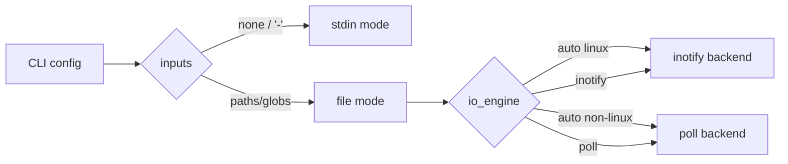
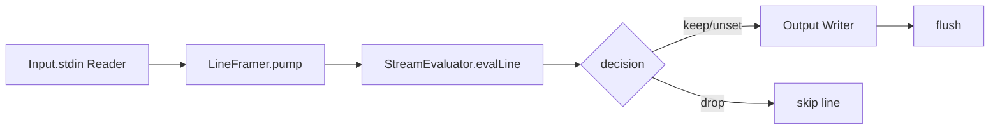
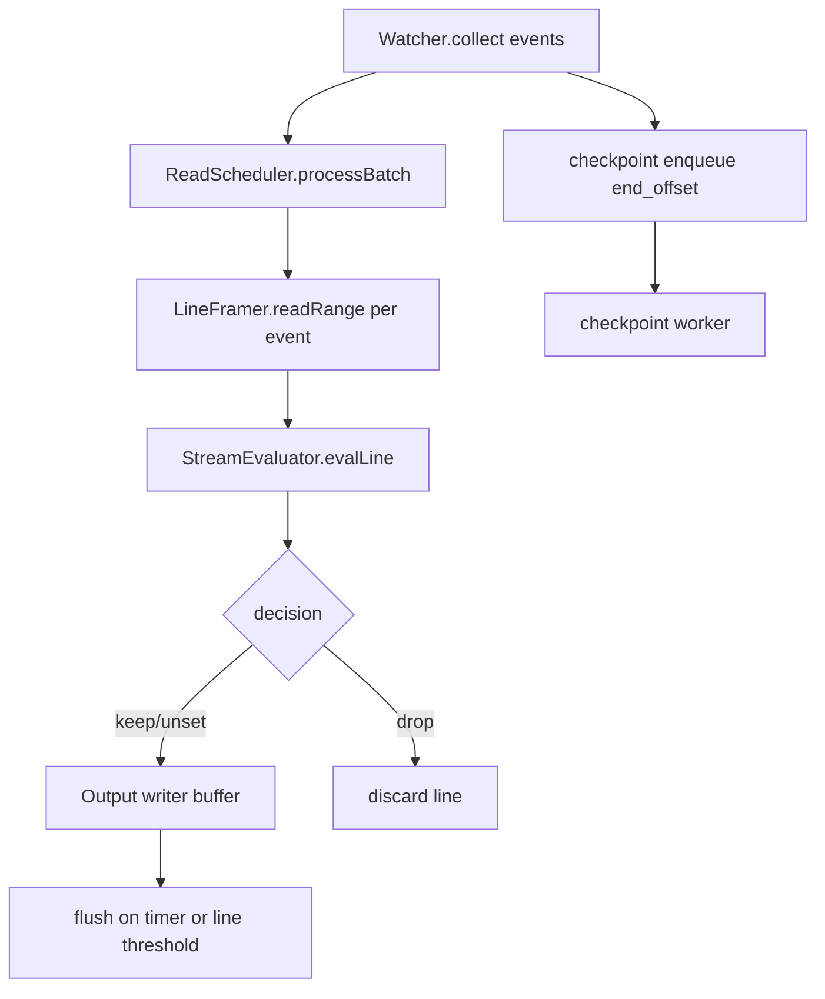
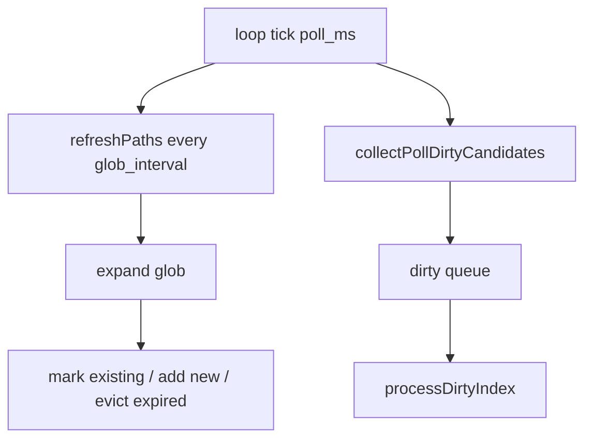
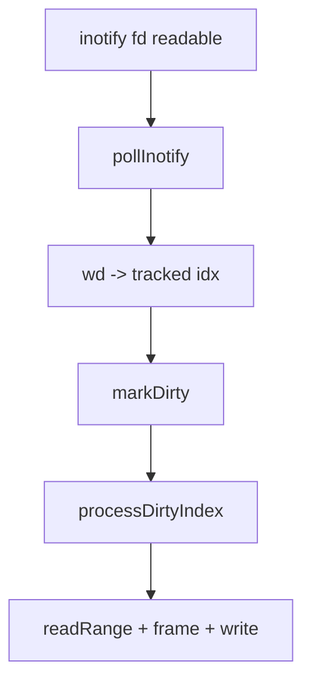
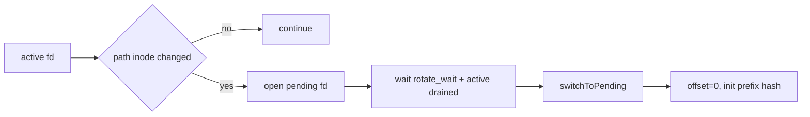
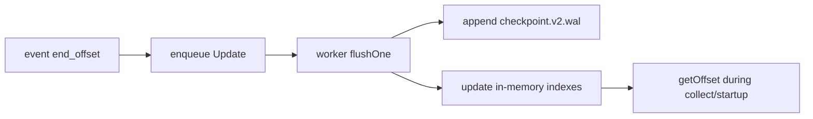

# tail

`tail/` contains the `edge-tail` implementation used by
`src/edge_tail_main.zig`.

## Module layout

- `types.zig`: config/types (`ReadFrom`, `IoEngine`, identity hash helpers)
- `io.zig`: `std.Io.Reader` / `std.Io.Writer` wrappers for stdin/file/stdout
- `watch.zig`: watcher/discovery/rotation state machine (`poll` or `inotify`)
- `read_scheduler.zig`: batched event execution into framer
- `framer.zig`: `pread`-based range reader + newline framing + max line cap
- `eval_stream.zig`: line-level policy evaluation (`policy_zig`) and filtering
- `checkpoint.zig`: async checkpoint lane + WAL recovery (`checkpoint.v2.wal`)
- `runtime.zig`: main loop orchestration and flush/checkpoint integration

## Runtime mode selection

- stdin mode: no file arguments, or single `-`
- file mode: one or more paths/globs
- watcher backend:
  - `IoEngine.inotify` (Linux)
  - `IoEngine.poll`
  - `IoEngine.auto` -> inotify on Linux, else poll

## Stdin mode

`runtime.runStream` path:

## File mode (shared pipeline)

`runtime.runFilesLoop` path:

Policy source:

- `--policy <path>` loads the same `policies.json` schema used in other
  distributions via `policy_zig.parser.parsePoliciesFile`.

## Poll + glob mode

Poll backend is event-driven from metadata deltas plus periodic glob refresh.

Dirty candidates in poll mode:

- unopened file slot
- active fd `fstat` failure
- active size differs from tracked offset
- path inode differs from active inode
- path size differs from active size
- pending rotation slot present

## Inotify mode

Linux inotify marks only watched indices as dirty, then runs the same
`processDirtyIndex` flow.

## Rotation and rewrite handling

Tracked slot keeps active fd and optional pending replacement fd.

Rewrite/copytruncate guards:

- if `size < offset`: reset offset to `0`
- if file head prefix hash changes unexpectedly: treat as rewrite and reset

## Checkpoint lane

Checkpoint updates are non-blocking on hot path (bounded queue), processed in a
worker thread.

Recovery and lookup:

- startup scans WAL and reconstructs map state
- lookup order:
  1. full identity hash `(dev,inode,fingerprint)`
  2. inode fallback `(dev,inode)`
- TTL (`checkpoint_ttl_ms`) evicts stale entries on read

## Performance properties

- no vtable polymorphism in tail runtime path
- SoA watcher state for tracked file fields
- dirty dedupe (`DynamicBitSet` + queue)
- no per-iteration allocation in framer pump
- flush by timer (`flush_interval_ms`) or processed line threshold

## Performance Gap Matrix

| Area                   | Current State                                                                                   | Target (Plan)                                                        | Risk                      | Next Step                                                                            |
| ---------------------- | ----------------------------------------------------------------------------------------------- | -------------------------------------------------------------------- | ------------------------- | ------------------------------------------------------------------------------------ |
| Watch loop (`poll`)    | Scans tracked files each loop to derive dirty candidates                                        | Event-first lifecycle with minimal full scans                        | High at large file counts | Add slow safety sweep, but drive normal updates from directory/file events only      |
| Watch loop (`inotify`) | Event-driven dirty marking, but still mixed with path replacement checks in per-file processing | Pure event-triggered path with bounded fallback checks               | Medium                    | Split rotation checks into event-cued path and periodic low-frequency reconciliation |
| Rotation detection     | Uses per-file path open/stat/fingerprint checks during processing                               | Rotation state machine triggered by specific lifecycle signals       | Medium/High               | Cache path metadata and only open path when replacement is suspected                 |
| Read execution         | Per-event `pread` via framer (`readRange`)                                                      | Batched read submission (`io_uring` in v2)                           | High                      | Introduce engine boundary that accepts a batch and returns completions               |
| Syscall amortization   | One read/write flow per event; buffered flush                                                   | writev/splice-style batching where possible                          | Medium                    | Add write batching surface in output module before splice fast-path                  |
| Checkpoint store       | WAL + in-memory maps + TTL on lookup                                                            | mmap slot array + WAL + seqlock + compaction pipeline                | High (durability/perf)    | Introduce fixed-slot map file and recovery/compaction phases from Step 5             |
| Checkpoint sync model  | Worker thread, mutex-protected maps                                                             | Lower-contention state application with deterministic slot ownership | Medium                    | Move to slot-indexed writes and reduce lock scope to queue pop only                  |
| Glob refresh           | Periodic full pattern expansion                                                                 | Incremental directory-driven discovery with timed reconciliation     | Medium                    | Track parent dirs and reconcile only changed directories + periodic audit            |
| Parallelism            | Single-threaded read/frame/write loop                                                           | File-level parallelizable processing units                           | Medium                    | Keep per-file state isolated and add optional worker lanes for read/frame            |
| Observability for perf | Basic tests, no detailed hot-path counters in runtime                                           | Built-in counters for syscall/dirty/read/flush/checkpoint pressure   | High (regression risk)    | Add counters and expose in benchmark harness assertions                              |

### Priority Order

1. Read batching boundary + backend abstraction (`pread` batch now, `io_uring`
   next)
2. Checkpoint slot-map architecture (durability + lower contention)
3. Watcher lifecycle refinement (event-first rotation/discovery, less path
   churn)
4. Output batching upgrades (`writev`, then selective splice in v2)
5. Perf counters + guardrail thresholds in `bench/logging`
