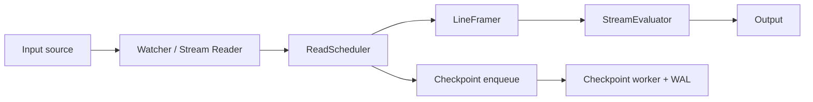
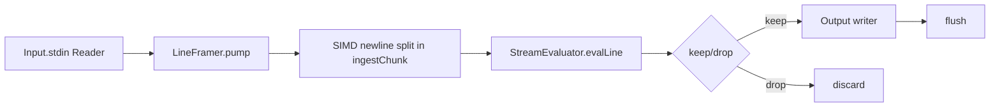
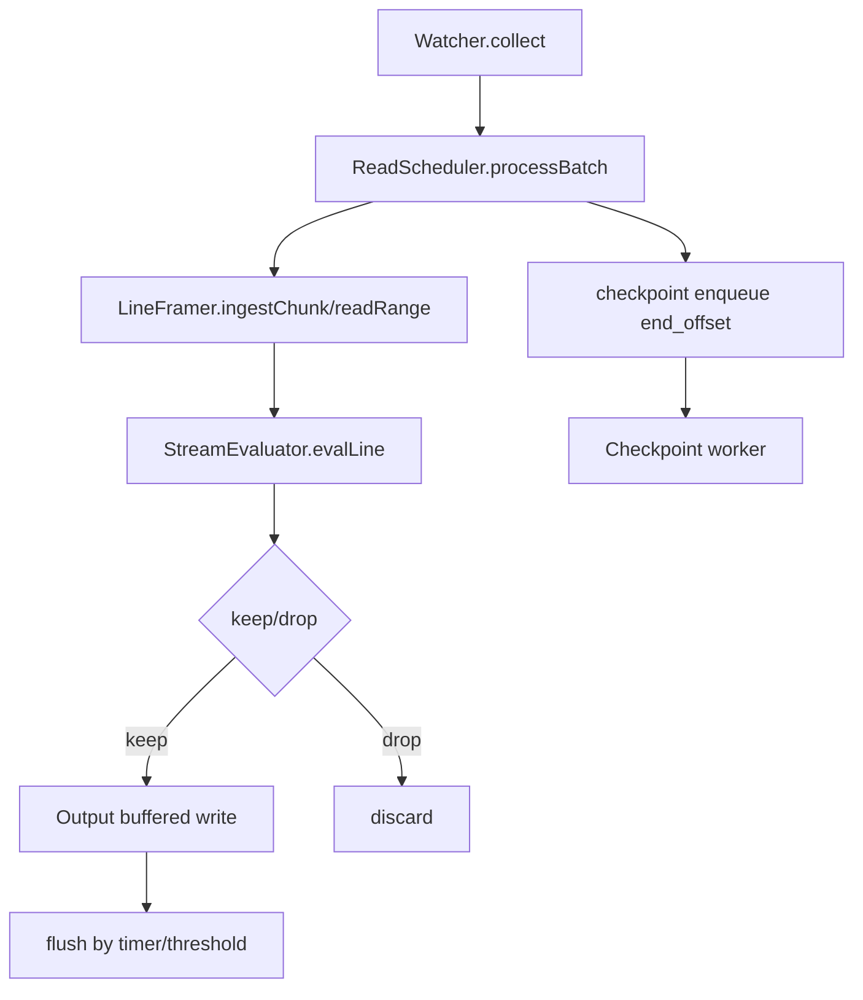
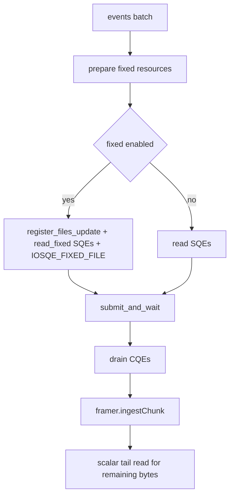
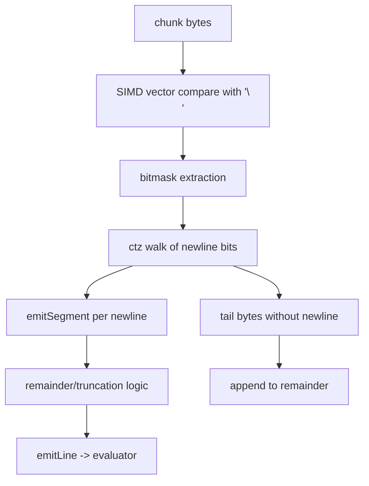
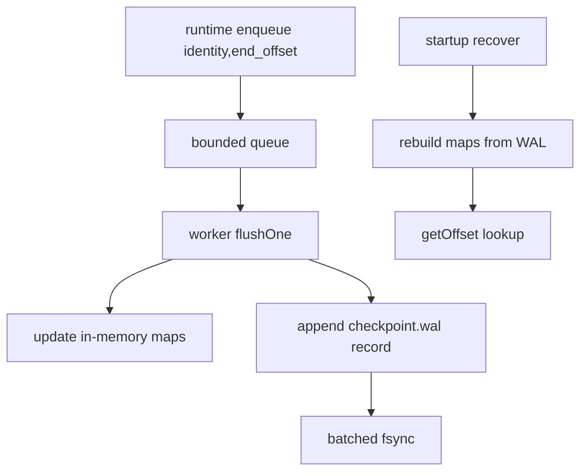
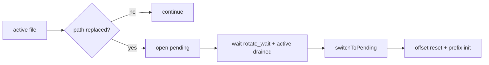

# tail

`tail/` is the file/stdin log tailing runtime used by `src/edge_tail_main.zig`.

This document describes the current architecture, where the hot path is
platform-specialized at compile time:

- Linux: `io_uring` watcher + batched read scheduler (+ fixed resources when
  available)
- macOS: `kqueue` watcher + scalar read fallback
- other targets: poll watcher + scalar read fallback

## Architectural Overview

### Main Modules

- `types.zig`: shared config/types, identity hashes, IO engine normalization
- `runtime.zig`: mode selection, loop orchestration, flush + checkpoint
  integration
- `watch.zig`: discovery/watch/rotation/rewrite state machine (`poll`, `uring`,
  `kqueue`)
- `read_scheduler.zig`: batched read execution (`uring` on Linux, scalar
  fallback elsewhere)
- `framer.zig`: chunk framing + policy handoff, SIMD newline scan in
  `ingestChunk`
- `eval_stream.zig`: policy evaluation/filtering
- `checkpoint.zig`: async checkpoint lane, WAL append/recovery, TTL lookups
- `io.zig`: stdin/file input and stdout/file output wrappers

### High-Level Dataflow



## IO Engine and Backend Selection

`types.normalizeIoEngine` resolves `auto` and compatibility aliases once for the
target:

- `auto` -> `uring` on Linux, `kqueue` on macOS, else `poll`
- `inotify` alias -> `uring` on Linux (else `poll`)
- `epoll` alias -> `poll`

This keeps backend branching centralized and prevents duplicated engine logic.

## Core Runtime Functions

## `runtime.runStream` (stdin mode)

Used when no file inputs are provided (or input is `-`).



Key property:

- No watcher/discovery/checkpoint path in stdin mode.

## `runtime.runFilesLoop` (file mode)

Main tail loop for files/globs.



Key properties:

- Persistent `ReadScheduler` object for reuse across loop ticks
- Buffered output with dual flush triggers:
  - time-based (`flush_interval_ms`)
  - line-threshold (`flush_line_threshold`)

## `watch.collect`

`Watcher.collect` does three stages:

1. refresh paths by glob interval
2. gather dirty candidates from backend
3. process dirty queue (`open/replace/rewrite/range emit`)

```mermaid
flowchart TD
  A[collect()] --> B{glob refresh due}
  B -- yes --> C[refreshPaths]
  B -- no --> D[skip]
  C --> E[collectBackendDirtyCandidates]
  D --> E
  E --> F[markPendingDirty]
  F --> G[dirty queue drain]
  G --> H[processDirtyIndex]
  H --> I[emit Event file,start,end,identity]
```

### Backend behavior differences

- `poll`: metadata checks (`fstat/stat`) detect dirty candidates
- `uring` (Linux): persistent inotify `POLL_ADD` + `READ` SQEs; `collect()`
  drains CQEs and re-arms
- `kqueue` (macOS): non-blocking `kevent` drain to map fd -> tracked index

## `read_scheduler.processBatch`

`ReadScheduler` takes watcher `Event`s and executes reads in a single pass.

### Linux `uring` path



### Non-Linux / fallback path


Key properties:

- Linux path batches SQEs/CQEs per loop tick
- Fixed resources are opportunistic: if registration/update fails, scheduler
  degrades safely to non-fixed/scalar behavior

## `framer.ingestChunk`

`ingestChunk` is the line-splitting hot path.



Key properties:

- SIMD scan finds all newline positions in each vector block
- Existing truncation semantics are preserved by routing through `emitSegment`
- Remainder bytes carry across chunks and flush on `finish()`

## `checkpoint.Lane`

Checkpointing is asynchronous with WAL persistence.



Lookup order:

1. full identity `(dev,inode,fingerprint)`
2. inode fallback `(dev,inode)`

TTL:

- stale entries are evicted on lookup (`checkpoint_ttl_ms`)

Durability model:

- at-least-once semantics (async enqueue + batched sync can replay some data on
  crash)

## Rotation and Rewrite Handling

The watcher tracks both active and pending file handles per path.



Rewrite guards:

- `size < offset` -> reset offset
- head-prefix hash changed unexpectedly -> treat as rewrite and reset

## Current Performance-Oriented Design Choices

- compile-time backend specialization by target
- event-driven watcher backends (`uring`/`kqueue`) with `poll` fallback
- batched Linux reads via `io_uring`
- opportunistic fixed resources (`register_buffers`, `register_files`)
- SIMD newline scanning for chunk splitting
- bounded, non-blocking checkpoint enqueue on hot path
- buffered writes with explicit flush cadence/threshold

## Future Optimization Queue

1. `fadvise`/`readahead` tuning
2. optional SQPOLL mode with guarded fallback
3. zero-copy forwarding mode (`splice` / linked SQEs) for no-policy paths
4. richer hot-path counters for benchmark guardrails
