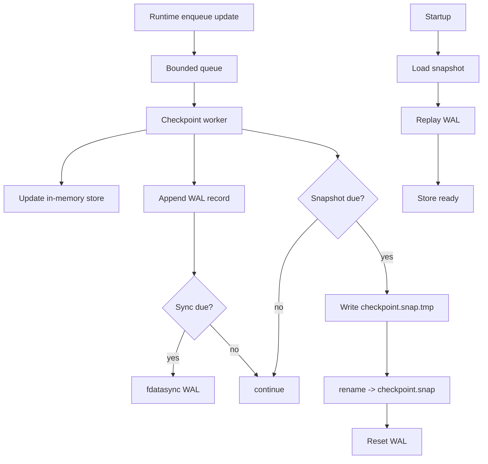

# Checkpointing Architecture

This module replaces the old checkpoint path with a simpler design focused on:

- cheap hot-path enqueue
- batched durability
- deterministic recovery
- isolated responsibilities per file

## Why this approach

The previous design mixed queueing, index management, mmap slot writes, WAL
sync, and recovery logic into one unit. That made lock behavior, durability
guarantees, and failure handling harder to reason about.

The new design separates concerns:

- `queue.zig`: bounded producer queue
- `store.zig`: in-memory indexes and eviction
- `wal.zig`: append-only durable journal
- `snapshot.zig`: periodic full-state snapshot
- `lane.zig`: worker orchestration

## Data model

Each update is `(FileIdentity, offset, last_seen_ns)`.

The in-memory store keeps two indexes:

1. identity hash `(dev,inode,fingerprint)`
2. inode fallback hash `(dev,inode)`

## Write path

1. Hot path calls `enqueue(update)`.
2. Background worker pops updates.
3. Worker updates in-memory store.
4. Worker appends to WAL (`checkpoint.wal`).
5. WAL `fdatasync` is batched (record count/time based), not per update.

## Snapshot and compaction

Periodically, worker:

1. Copies current store values.
2. Writes `checkpoint.snap.tmp` then renames to `checkpoint.snap`.
3. Syncs WAL if needed.
4. Resets WAL (truncate to zero).

After a successful snapshot, WAL only needs to contain newer updates.

## Recovery

Startup recovery order:

1. Load `checkpoint.snap` (if present and valid entries).
2. Replay valid WAL entries in order.
3. Persist fresh snapshot and reset WAL.

Corrupt or partial WAL/snapshot entries are ignored during replay/load.

## Durability model

- WAL gives crash recovery between snapshots.
- Snapshot bounds replay time and WAL size.
- Batched sync reduces I/O stalls vs per-update sync.
- This is at-least-once checkpoint persistence with bounded loss window (between
  sync points).

## Tunables

The lane is controlled by these config knobs:

- `checkpoint_interval_ms`: base worker tick and periodic maintenance cadence.
- `checkpoint_sync_batch`: number of queued WAL records before forcing
  `fdatasync`.
- `checkpoint_snapshot_interval_ms`: interval between snapshot rewrite + WAL
  reset.
- `checkpoint_ttl_ms`: age cutoff for stale checkpoint entries.
- `checkpoint_max_slots`: max in-memory tracked identities.

## mmap / seqlock note

This implementation intentionally does **not** keep mmap in the hot path.

Reasons:

- simpler locking and recovery semantics
- fewer failure modes under pressure
- easier to tune and debug

If needed, mmap can be reintroduced later as an optional read cache layer, but
WAL + snapshot remains the source of truth.

## Flow diagram

