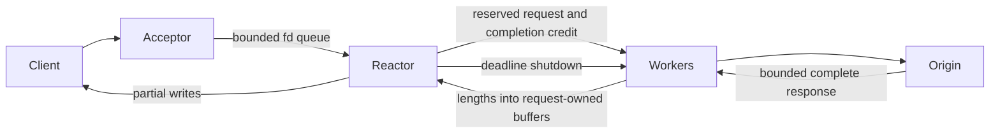

# Run the phase-1 relay

```sh
zig build v2 -Doptimize=ReleaseSafe
./zig-out/bin/edge-v2 --listen 127.0.0.1:8080 --upstream 127.0.0.1:8081
curl http://127.0.0.1:8080/health
curl --data-binary @payload.json http://127.0.0.1:8080/v1/logs
```

Run an HTTP origin on port 8081 first. The opt-in executable forwards arbitrary
paths to that one configured origin, replacing Host with `--upstream` (or explicit
`--authority`). It preserves opaque body bytes, query strings, duplicate end-to-end
headers and supported trailers. Existing production executables are unchanged.

This completes the **phase-1 raw HTTP vertical slice**, not a production replacement.
It uses numeric IPv4/IPv6 endpoints, plain HTTP on both legs, one reactor, a fixed
forwarder pool and one upstream connection per exchange. DNS resolution, upstream
TLS/pooling, production route/config parity and policy processing are later work.
The phase-0 TLS/deadline probes remain separate from this runnable transport. No
endpoint silently falls back from HTTPS to HTTP: this CLI accepts IP:port, not URLs.



## Configuration and bounds

| Flag | Default | Meaning |
|---|---:|---|
| `--connections` | 64 | Accepted client slots; a separate bounded handoff queue has the same capacity |
| `--requests` | 16 | Admitted input/output slots and reserved completion credits |
| `--workers` | 4 | Fixed upstream lanes, maximum 64 |
| `--body-bytes` | 1048576 | Input entity limit per admitted request, maximum 64 MiB |
| `--response-bytes` | 1048576 | Response entity limit per request, maximum 64 MiB |
| `--timeout-ms` | 5000 | Absolute ingress/admission/upstream budget; a new bounded budget applies to downstream delivery |
| `--budget-bytes` | 134217728 | Maximum calculated application reservation, including configured thread stacks |

Headers are limited to 16 KiB/64 fields; trailer storage is 4 KiB/16 fields. The
receiver bounds informational count and total head bytes. Informational responses
other than 100 are buffered and sent in order before the final HTTP/1.1 response;
HTTP/1.0 clients receive no informational responses. This delays Early Hints until
the final response is complete. Local Continue is sent once, after admission; Expect
is removed upstream. Unsupported expectations receive 417. Body/head limit violations
receive 413/431 when known; malformed framing receives 400. Incomplete client input,
expired admission and stalled downstream writes close the connection without success.

The worker finishes and validates the upstream response before publishing. Truncated,
invalid or oversized upstream responses receive 502; expired exchanges receive 504.
There are no automatic retries and no spool in phase 1. An origin may have accepted a
request before a timeout; a client retry can therefore duplicate delivery. Successful
responses reflect the origin's result, not a new local durability guarantee.

Admission keeps body memory independent of idle clients. `/health` needs neither a
request slot nor a worker, so it remains available when the work queue is full; it
still requires connection/fd capacity. Bodies stay in their reserved request slots
through worker completion and final downstream writes. Slow clients cannot retain
worker scratch. Each reactor event reads at most one head-buffer span or writes at
most 64 KiB; accepts and grants have fixed turn budgets. The 10 ms finite poll interval
bounds watchdog checks and recovery from failed/coalesced wake notifications.

Startup rejects invalid limits, an aggregate reservation above the ceiling and a
calculated fd demand above the existing process limit. Application allocations occur
at startup; worker stacks are 512 KiB each, as is the acceptor stack. Accounting also
includes an 8 MiB main-stack allowance. It is **not an RSS limit**: allocator metadata,
thread implementation overhead, std.Io backend state and kernel socket buffers are
outside the formula. Lazy page commitment explains why measured RSS can be smaller
than the reservation. Codec/regex/C allocation accounting belongs to later phases.

## Shutdown and policy recovery

SIGINT/SIGTERM stop acceptance, join the acceptor, detach clients, close the work
queue, shut down watched upstream sockets, acknowledge all late completions and join
workers before destroying storage. Native nonblocking connect checks shutdown at
most every 10 ms. Phase 1 chooses bounded abort on shutdown; clients do not receive
fabricated successes for aborted work. Durable drain/replay arrives with the spool.

Quarantine decision for phase 2: keep serving raw traffic and report degraded policy
health; do not auto-exit on a failed publication. Stop/join the affected providers,
never reuse the quarantined registry, retain its allocator until process exit, and
require an operator restart to restore processing. This avoids a restart loop taking
out raw forwarding. Phase 1 creates no policy registry, so that recovery wiring is
part of phase 2, not an untested policy path hidden in this executable.

## Verify and measure

```sh
zig build test
zig build test -Doptimize=ReleaseSafe
zig build datadog otlp prometheus tail edge lambda -Doptimize=ReleaseSafe
task lint
python3 tests/v2/relay.py
python3 tests/v2/relay.py --benchmark 1000
```

The Python fixture uses only the standard library and a real loopback origin. Set
`EDGE_V2_BINARY` to test another build. It covers binary bodies, chunked input/output
trailers, Continue and informational ordering, HTTP/1.0, HEAD, pipelining, health under
saturation, concurrent admission, half-close/disconnect, silent/trickling upstreams,
truncation, slow/stalled readers, invalid startup budgets and shutdown during work.

Initial native macOS arm64 ReleaseSafe result, 1,000 sequential 4 KiB POST/echo
exchanges on one downstream keep-alive connection: **6,161 requests/s, p50 0.152 ms,
p99 0.280 ms, 4,915,200 bytes child peak RSS**, 12,714,782 calculated reserved bytes,
1,000 completed and zero failed. Origin and client run in Python in the parent
process; RSS/CPU output describes the relay child. This is a reproducible smoke
baseline, not a comparison with the old runtime or evidence for production defaults.
Stack high-water instrumentation and mixed-load tuning remain later acceptance work.
